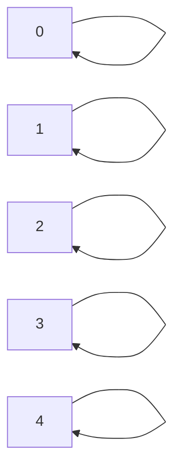
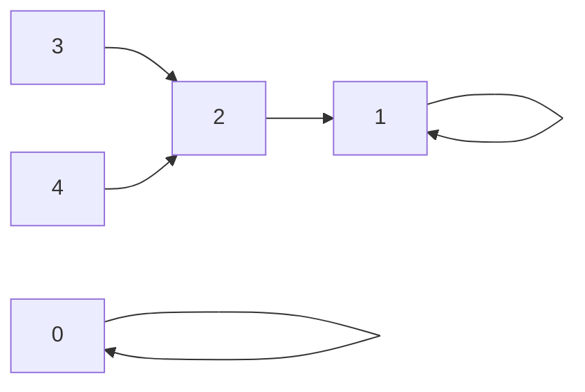
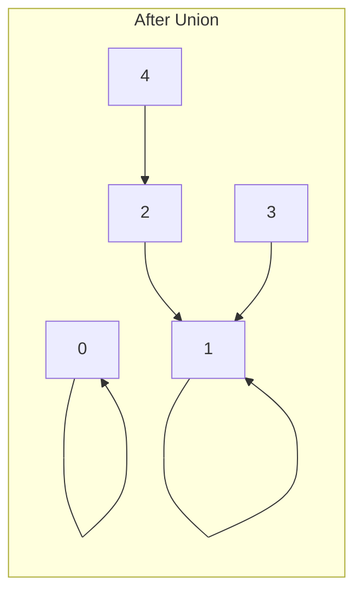
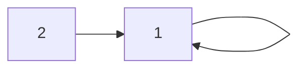
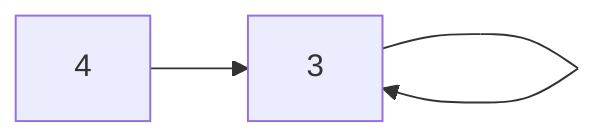
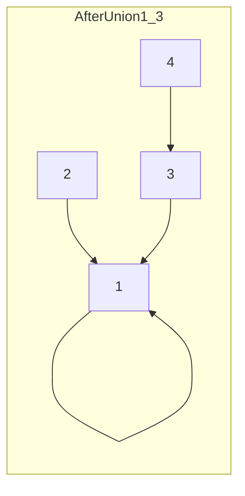

# Weighted Union-Find Algorithm

The **Weighted Union-Find** algorithm is a data structure that efficiently handles dynamic connectivity queries, such as determining whether two elements are in the same connected component or merging two components.

## Key Concepts

- **Union**: Connects two elements by linking their components.
- **Find**: Identifies the root of the component containing a given element.
- **Weighting**: Ensures that smaller trees are always added under larger trees to keep the structure flat and efficient.

## Steps of the Algorithm

### 1. Initialization
Each element is initially its own root.
- The `id` array keeps track of the parent for each element.
- The `sz` array stores the size of the tree rooted at each element.



### 2. Find Operation
Traverse the tree upward from the element until reaching the root.
- Apply path compression by making nodes point directly to the root, flattening the tree.



### 3. Union Operation
Connect the roots of two elements.
- Attach the smaller tree under the larger tree (weighted by the number of elements).
- Update the `sz` array to reflect the new size of the trees.



## Example

Let's consider a sequence of `union` operations and observe how the tree evolves:

### Union(1, 2)
- Elements 1 and 2 are connected. Since they are separate, we connect them.
- The tree size for root `1` becomes `2`.



### Union(3, 4)
- Elements 3 and 4 are connected similarly.



### Union(1, 3)
- Now we connect the two trees rooted at `1` and `3`.
- Since both trees are of the same size, we choose one to be the new root, say `1`.



## Efficiency

- **Find Operation**: Nearly constant time due to path compression.
- **Union Operation**: Nearly constant time due to tree weighting.

By keeping the trees flat, the algorithm ensures that both the `union` and `find` operations are efficient, making it suitable for handling large datasets with dynamic connectivity requirements.

## Algorithm Implementation in JavaScript

```javascript
const createWeightedQuickUnionUF = (N) => {
    const id = Array.from({ length: N }, (_, i) => i);
    const sz = Array(N).fill(1);

    const root = (i) => {
        while (i !== id[i]) {
            id[i] = id[id[i]]; // Path compression
            i = id[i];
        }
        return i;
    };

    const union = (p, q) => {
        const i = root(p);
        const j = root(q);
        if (i !== j) {
            if (sz[i] < sz[j]) {
                id[i] = j;
                sz[j] += sz[i];
            } else {
                id[j] = i;
                sz[i] += sz[j];
            }
        }
    };

    const connected = (p, q) => root(p) === root(q);

    return { union, connected };
};

// Example Usage:
const uf = createWeightedQuickUnionUF(10);
uf.union(4, 3);
uf.union(3, 8);
console.log(uf.connected(4, 8)); // true
console.log(uf.connected(1, 0)); // false
```

This implementation follows the Weighted Union-Find approach, utilizing modern JavaScript practices such as arrow functions, object literals, and array methods.
