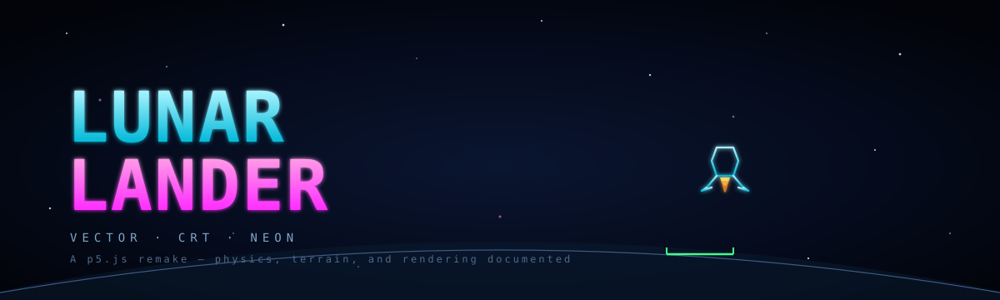
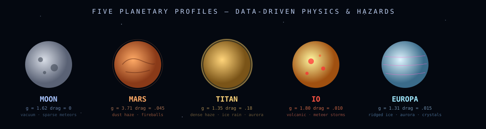
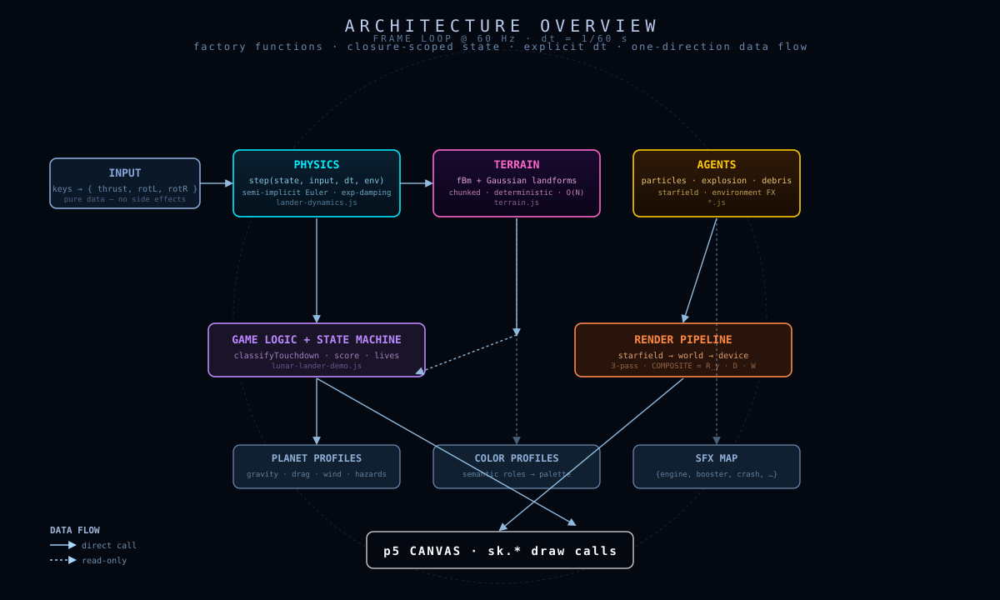

# 🌖 Lunar Lander — Neon-Vector Planetary Descent

> *A cinematic, physically-plausible, deterministic arcade descent game built as a CS canon entry — every line of code was written to make a mathematical or algorithmic idea legible from the source.*

<p align="center">
  
</p>

---

## Table of Contents

- [What this is](#what-this-is)
- [Inspiration](#inspiration)
- [Quick start](#quick-start)
- [Controls](#controls)
- [Architecture at a glance](#architecture-at-a-glance)
- [Coordinate conventions](#coordinate-conventions)
- [Documentation map](#documentation-map)
- [Engineering philosophy](#engineering-philosophy)
- [License](#license)

---

## What this is

This is a remake of the 1979 Atari *Lunar Lander* in the spirit of *Jupiter Lander* (Commodore 64, 1982) — but rebuilt around three modern ideas:

1. **A neon-vector aesthetic** reminiscent of XY-monitor arcade hardware (*Asteroids*, *Tempest*, *Gyruss*).
2. **A deterministic, seed-driven physics + terrain pipeline** — every game can be replayed bit-exactly.
3. **A clean separation between math, simulation, and rendering** — physics never reaches into p5, p5 never reaches into physics.

The game ships with **five planetary profiles** (Moon, Mars, Titan, Io, Europa), each with its own gravity, atmosphere, drag, wind, and environmental hazards (meteors, ice rain, volcanic cinders, aurora ribbons).

<p align="center">
  
</p>

---

## Inspiration

| Era | Source | What we borrow |
|---|---|---|
| 1979 | Atari *Lunar Lander* | Side-on descent, fuel gauge, multiplier pads, vector lines |
| 1982 | *Jupiter Lander* (C64) | Difficulty-classified pads (1×, 2×, 3×, 5×), cinematic terrain |
| 1979 | Atari *Asteroids* | Vector outlines, neon CRT glow, rotational inertia feel |
| 1983 | *Gyruss* | Saturated alternative palette (purple/cyan/magenta) |

The visuals are not nostalgic for the sake of nostalgia — vector lines and glow-passes are the cheapest possible way to convey scale on a 1024×768 canvas, which is the whole reason the arcade originals looked the way they did.

---

## Quick start

```bash
# Required for older webpack/Node interop
export NODE_OPTIONS=--openssl-legacy-provider

npm install
npm run dev    # webpack-dev-server at http://localhost:8080
```

The active demo is selected in `src/index.js` by the `demoName` variable. Set it to `lunar-lander` and reload.

---

## Controls

```
↑ / SPACE     Main engine (binary thrust, consumes fuel)
←             RCS thruster — rotates nose left  (dθ/dt < 0)
→             RCS thruster — rotates nose right (dθ/dt > 0)
R             Reset round (new seed)
D             Cycle spawn-difficulty profile  (EASY → NORMAL → HARD → CHALLENGE)
C             Cycle visual color profile      (Vector Lunar ↔ Gyruss Neon)
P             Cycle planet profile            (Moon → Mars → Titan → Io → Europa)
```

The HUD reports altitude, descent rate, lateral drift, fuel, throttle, tilt, profile, target pad, and a single-word **warning state** (`NOMINAL` / `DESCENT RATE` / `LATERAL DRIFT` / `LEAN` / `NO PAD` / `OUT OF FUEL`). Three colored dots on the right show whether each landing-safety criterion is currently green.

---

## Architecture at a glance

<p align="center">
  
</p>

The game is a single factory function (`createLunarLanderArcadeDemo`) that wires together small, independent modules. Nothing inherits, nothing extends. Modules communicate only through plain data:

| Module | What it knows | What it doesn't know |
|---|---|---|
| `lander-dynamics.js` | The ODE | p5, scene, terrain, audio |
| `terrain.js` | Procedural heightmap + pads | The lander |
| `planet-profiles.js` | Gravity, drag, wind, hazards as **data** | Anything else |
| `color-profiles.js` | Palettes by semantic role | Geometry, dynamics |
| `lunar-particles.js` | Plume, dust, pad pulses | Physics state |
| `lander-explosion.js` | Vector fragmentation | Game state |
| `neon-debris.js` | Environmental debris ODEs | The lander state |
| `environment-effects.js` | Per-planet hazard orchestration | Rendering details |
| `starfield.js` | Parallax background | Camera math |
| `lunar-lander-demo.js` | Wires it all together | The math (just the orchestration) |

The line between **simulation** and **rendering** is a hard one. Physics modules return new state objects; rendering modules call `sk.*` (p5) and read but never mutate state.

---

## Coordinate conventions

This is the single most important convention in the codebase, and **every diagram, equation, and explanation in `/docs` respects it**.

### World coordinates

```
+X →  right
+Y ↑  up      (Cartesian, math-textbook)
```

All physics, terrain heights, particle positions, and camera windows live in this frame.

### Attitude

```
θ = 0      nose points +Y          (straight up)
θ > 0      nose rotates toward +X  (visually: to the right)
θ < 0      nose rotates toward −X  (visually: to the left)
```

The canonical thrust direction is:

```js
const thrustDir = theta => [Math.sin(theta), Math.cos(theta)];
```

At θ = 0, thrust is `[0, +1]` — straight up. ✅

> **Note on rotation sign.** In a Y-up Cartesian frame, *positive θ* as defined here corresponds to a **clockwise** visual rotation of the lander's nose. This is the opposite of the "math textbook" CCW-positive convention, and is a deliberate game-design choice: the **right** arrow key feels like it should rotate the ship to the **right** (positive θ, positive ω). See [`docs/physics.md`](docs/physics.md#rotation-sign-convention) for the full derivation and the rotation matrix.

### Rendering pipeline

Canvas (p5) is Y-down, so all world rendering is composed through a single transform:

```
COMPOSITE = REFLECT_Y · DEVICE · WORLD
```

- `WORLD` maps the current camera window to normalized `[0,1] × [0,1]`.
- `DEVICE` scales `[0,1] × [0,1]` to pixel space `[0,W] × [0,H]`.
- `REFLECT_Y` flips Y so +Y world → up on screen.

See [`docs/architecture.md`](docs/architecture.md#transform-pipeline) for the full pipeline.

---

## Documentation map

| File | What's in it |
|---|---|
| [`docs/architecture.md`](docs/architecture.md) | Game loop, transforms, module graph, state machine, rendering pipeline |
| [`docs/physics.md`](docs/physics.md) | Equations of motion, semi-implicit Euler, rotation, damping, landing predicate |
| [`docs/terrain.md`](docs/terrain.md) | fBm, value noise, Gaussian landforms, slope limiting, pad carving, chunked terrain |
| [`docs/lander.md`](docs/lander.md) | Lander geometry, control flow, contact, scoring |
| [`docs/algorithms.md`](docs/algorithms.md) | Every algorithm in the project, with pseudocode and complexity |
| [`docs/appendix_math.md`](docs/appendix_math.md) | Rotation matrices, integrators, noise theory, Gaussian basis, LCG |
| [`docs/agents.md`](docs/agents.md) | How the active agents (lander, debris, particles, camera) interact each frame |
| [`docs/visuals.md`](docs/visuals.md) | Neon-glow rendering, color profiles, pulse functions, bloom |
| [`docs/planets.md`](docs/planets.md) | Planet profiles, environment effects, atmosphere & wind, hazards |
| [`docs/audio.md`](docs/audio.md) | SFX map, engine loop invariants, audio gating |

---

## Engineering philosophy

This project is part of a personal CS canon and follows two non-negotiable rules:

> **Resemblance.** The implementation should resemble the mathematical object that generated it. We write `v ← v + a·dt; p ← p + v·dt` because that's literally the integrator. We write `I = (a·A + b·B + c·C) / (a + b + c)` because that's the incircle formula. We do *not* hide the math behind opaque helpers.

> **Composition.** Factories and closures, not classes. Plain objects, not models. `sk.*` for every p5 call, never globals. `M2D` and `V` for math, never invented helpers. Explicit `dt` everywhere, never frame-dependent constants.

See [`ENGINEERING_PHILOSOPHY.md`](ENGINEERING_PHILOSOPHY.md) at the repo root for the full rationale.

---

## License

MIT — see [LICENSE](LICENSE).
