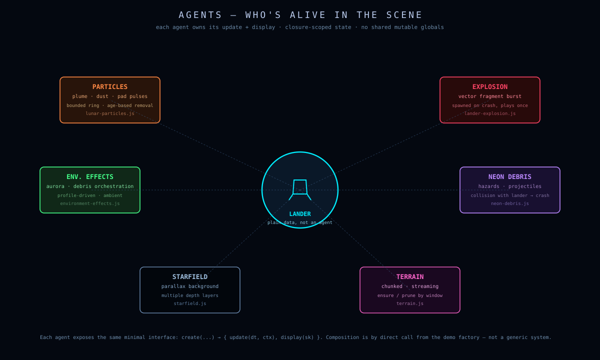
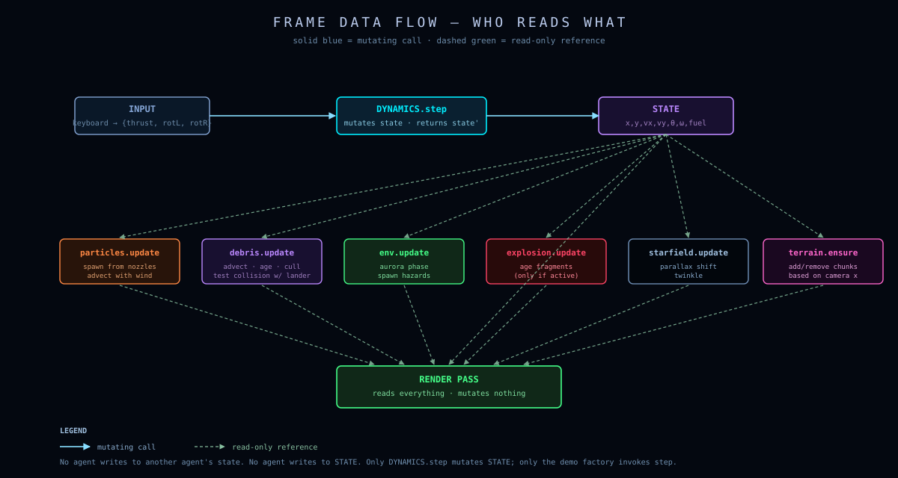

# Agents

> An *agent* is anything that maintains internal state and updates itself once per frame.
> This document is a roster of every active agent in the game and a description of how they interact each frame.
> Each agent is small. Each agent has one job. None of them know about each other directly — they communicate only through plain data passed by the demo factory.

---

## Table of contents

- [Definition of an "agent" here](#definition)
- [Roster](#roster)
- [Per-frame interactions](#per-frame-interactions)
- [Communication discipline](#communication-discipline)
- [Lifetimes](#lifetimes)

---

## Definition

The game does **not** use an Entity-Component-System framework or behavior trees. We borrow the *word* "agent" from AI literature to describe any of these:

> A small system with internal mutable state, an `update(dt)` method that advances that state, and (usually) a `display(...)` method that draws it. The system makes its own local decisions but doesn't know about the global game state.

This pattern is sometimes called an **active object** or **autonomous component** in game-dev literature.

What an agent does *not* do:

- Inherit from a base class.
- Subscribe to events.
- Mutate other agents' state.
- Read global variables.

What it *does* do:

- Expose factory `createX(seed[, ...])` → returns a plain object with closure-captured state.
- Receive everything it needs as arguments to `update(dt, ...)`.
- Be reset by being thrown away and recreated (`createX` again).

---

## Roster

The active agents in the game, by category:

<p align="center">
  
</p>

### Primary agent — the lander

```js
state = {
    pos: [x, y], vel: [vx, vy], theta, omega, fuel
};
state = step(state, input, dt, planetProfile);
```

Strictly speaking, the lander is not a closure-based agent — it's a *plain object* that gets replaced each frame by `step(state, input, dt, env)`. Its "agency" is encoded in the input it reads from the keyboard and in the contact predicate that snaps it to the ground.

The decision to make the lander plain data and *not* an object with internal state is deliberate. Plain data:

- Is trivially serializable (replays, save state).
- Has no hidden side effects — `step` is a pure function.
- Reads like the ODE it implements.

### Visual / particle agents

| Agent | Created by | Internal state | Driven by |
|---|---|---|---|
| `starfield` | `createLunarStarfield(seed, count)` | Star positions, twinkle phases, layer assignment | Camera center |
| `particles` | `createLunarParticles(seed)` | Plume / dust / pad-pulse particle lists, light-flash | Throttle, exhaust direction, lander position |
| `explosion` | `createLanderExplosion(seed, state, geom)` | Fragment list, sparks, shock-ring lifetime | Self-only (no external input post-creation) |
| `environmentEffects` | `createEnvironmentEffects(seed)` | Internal `neon-debris` system | Planet profile, visible window, lander state, terrain height function |
| `shake` | `createCameraShake(sk)` | Shake amplitude, time remaining | Crash impact + landing kick |

### Data-only "agents"

These are immutable data tables, not real agents. We list them because they parameterize the active agents:

| Object | Type | Purpose |
|---|---|---|
| `planetProfile` | frozen object | Gravity, drag, wind, hazard rates |
| `colorProfile` | frozen object | Palette by semantic role |
| `terrain` | object with `getChunk(i)` | Procedural heightmap |

The terrain is interesting — it has internal state (the chunk cache `chunks[]`) and a `getChunk` method that lazily generates new chunks on demand. But it has no `update(dt)` — its state is purely cache-based.

---

## Per-frame interactions

Each frame, the demo factory orchestrates a fixed sequence of agent updates. Here is the full data-flow for a single frame, with each agent's role visible:

<p align="center">
  
</p>

In sequence:

```text
1. Read input (UP, LEFT, RIGHT) into a plain {thrust, rotLeft, rotRight} object.

2. effectiveThrottle(state, input)  →  τ ∈ {0, 1}
   This single value gates physics, audio, flame, particles, HUD.

3. Audio: based on τ and rotation input, start/stop engine loop and trigger
   booster chirps (rate-limited).

4. state = step(state, input, dt, planetProfile)
   Pure function. Reads gravity/drag/wind from the planet profile.

5. flameLen = exponential smooth(flameLen, τ, k=18, dt)

6. particles.emitPlume(nozzleWorld(state), exhaustDir, τ, dt)
   particles.emitDust(... )  if foot is close to ground
   particles.emitPadPulse(localPad, tier, padApproachStrength(localPad), dt)
   particles.update(dt)

7. Contact test:  footWorldY  ≤  heightAt(terrain, state.pos[0])
   If true:
     • Snap velocity to zero.
     • classifyTouchdown(state, padUnderLander)
     • On safe:  score += calcScore(state, pad); play landing audio.
     • On crash: lives--; explosion = createLanderExplosion(seed, state, geom)
     • In both: particles.flash(1) or emitLandingDust(...)

8. shake.update(dt)

9. updateCamera(camera, state, dt)
   The camera reads only state.pos, state.vel, and terrain.

10. starfield.update(dt)

11. environmentEffects.update(dt, planet, visibleWin, state, profile, heightFn)
    The hazard system can read state for proximity warnings; it never writes to state.

12. RENDER (three passes, see docs/architecture.md):
    Background → World → HUD
    Each agent's display() function gets sk + pixelToWorld + colorProfile.
```

---

## Communication discipline

The single most important rule: **agents never mutate each other's state**.

The data flows in **one direction** per frame:

```
        input → state → audio
                │
                ├→ camera
                │
                ├→ particles  (read state, write own list)
                │
                ├→ shake      (read kick events, write own state)
                │
                ├→ explosion  (created from state on crash, then runs alone)
                │
                └→ HUD        (read state)

         terrain (read by state contact, particles, camera, environmentFx)

         planet  (read by state.step, environmentFx)
```

The dotted arrows you might expect — particles influencing physics, the lander influencing debris physics, debris influencing the lander — **do not exist**. Each agent is local.

The one exception is the **warning event** from `neon-debris`:

```js
if (state && d.hazard && !d.warned) {
    const dist = Math.hypot(state.pos[0] - d.pos.x, state.pos[1] - d.pos.y);
    if (dist < d.radius + 14) {
        d.warned = true;
        pushLog('WARNING: METEOR SHEAR', d.color, 1.6);
        shards.burst(...);
    }
}
```

This is *read-only* on `state.pos` — the debris uses the lander's position to decide whether to log a warning and emit some warning shards. Critically, the debris does not damage the lander; collisions between hazards and the lander are a v2 feature and are not implemented in v1.

---

## Lifetimes

### Game-lifetime agents

Created once at game start, reset only by `R`:

- The demo factory itself
- Audio (`SFX`)
- The composite transform (rebuilt each frame, but the canvas/aspect bindings don't change)

### Round-lifetime agents

Created at `startRound()` and torn down on the next round transition:

- `terrain` (only on a new seed — same-seed crash retry reuses the terrain)
- `starfield`
- `environmentEffects`
- `particles`
- `state`
- `camera`

### Event-lifetime agents

Created in response to specific events, run until done, then thrown away:

- `explosion` — created on crash, dies after all fragments and sparks fade
- Individual particles in `lunar-particles.js` — created by emission, die when `life ≤ 0`
- Individual debris pieces in `neon-debris.js` — created by per-rate spawn, die from terrain impact, off-screen, or TTL
- Camera-shake kicks — created on impact, decay exponentially

The lifetime pattern is consistent: **construct once, run, die**. There is no pool, no recycle, no reuse. JavaScript's garbage collector handles cleanup, and the per-particle allocation cost is dwarfed by the rendering work.

If profiling ever showed allocation pressure (it hasn't), we'd switch to free-list pools for the per-frame particles. But the current design is simpler and "good enough."

---

## A note on "AI"

There is no AI in this game.

The closest we come is:

1. **Pad selection** in terrain generation — picks pads from the top-k of a scored candidate list.
2. **Approach strength heuristic** — assigns a continuous "is the lander landing on me?" value to each pad.
3. **Spawn-x selection** — picks an interesting spawn location.

None of these are agents in the AI sense. They are pure functions of the random seed and the current state.

The future roadmap (see [`docs/planets.md`](planets.md#future-hazards)) includes SAM sites and missiles with proportional-navigation guidance. Those *would* be agents in the full sense: each missile would have its own state, sensor cone, control law, and update step. The architecture above is designed to make adding them trivial — they'd be another item in the roster, with their own `update(dt, missiles[], state, terrain)` and `display(sk, pixelToWorld, profile)`.

The key invariant: **even those future agents would never mutate the lander's state.** They might destroy the lander by triggering a crash, but the trigger is a clean event (set `phase = 'crashed'`, create an explosion), not a slow-drip mutation across multiple frames.
