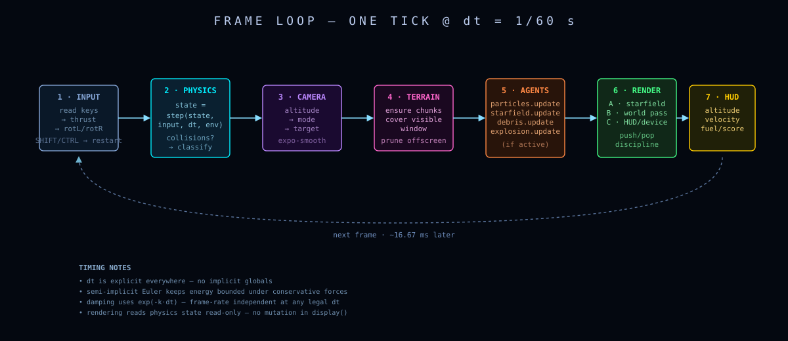
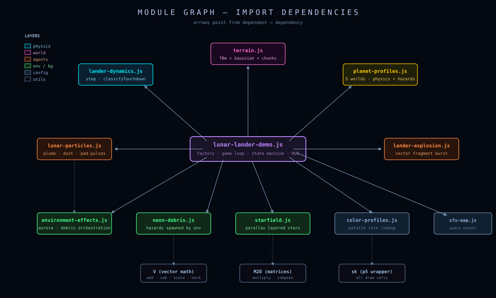
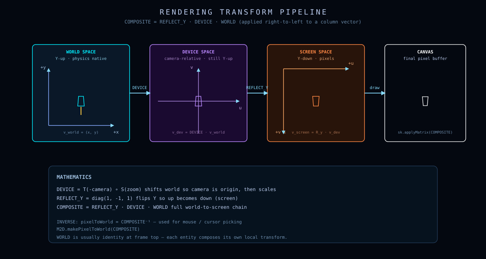
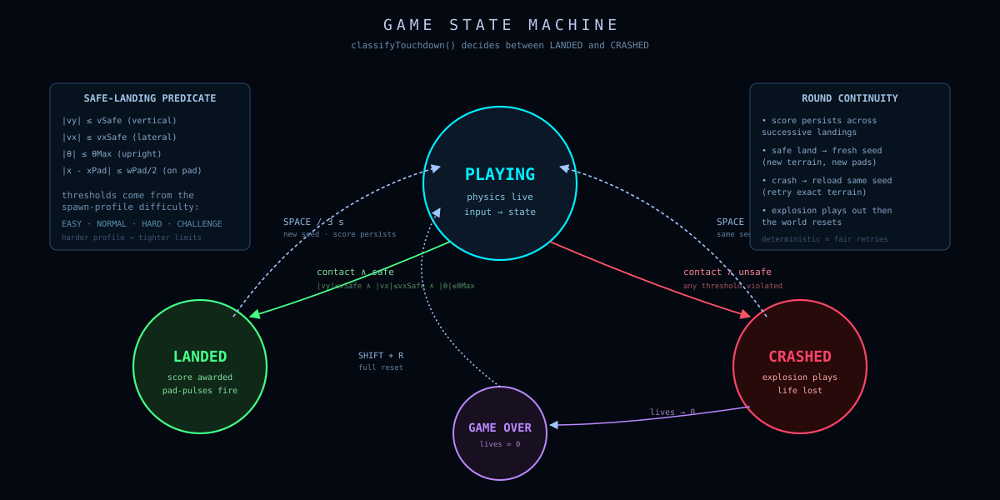
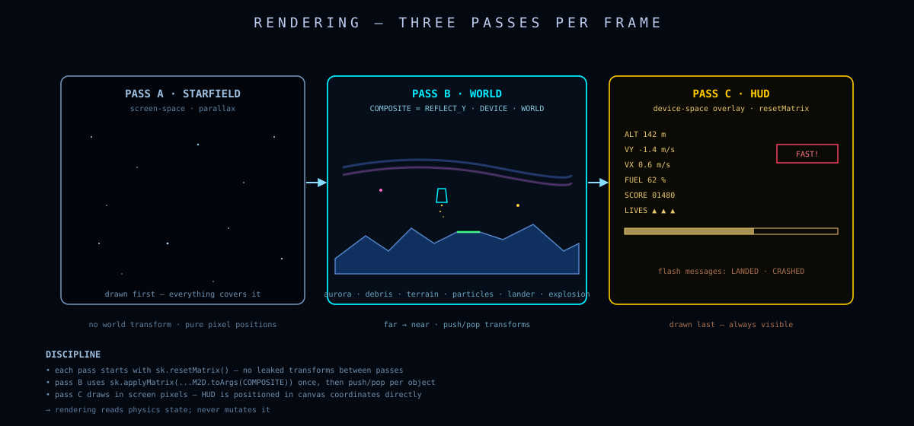
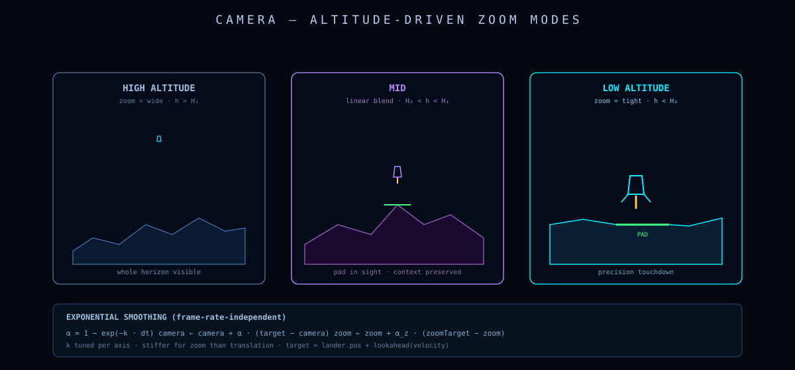

# Architecture

> Every frame, this game performs a six-stage dance:
> read input, advance physics, resolve contact, update camera, update particles, render.
> This document explains each stage, the data that flows between them, and the rules that keep simulation cleanly separate from rendering.

---

## Table of contents

- [The frame loop](#the-frame-loop)
- [Module graph](#module-graph)
- [Transform pipeline](#transform-pipeline)
- [State machine](#state-machine)
- [Rendering pipeline](#rendering-pipeline)
- [Camera](#camera)
- [Deterministic seeds](#deterministic-seeds)

---

## The frame loop

The whole game lives inside one factory function and one `display()` callback. Every frame:

<p align="center">
  
</p>

In pseudocode:

```text
function display():
    dt           = clamp(sk.deltaTime / 1000, 0, 0.05)

    update(dt)                          # advances state
    updateCamera(camera, state, dt)     # follows the lander
    starfield.update(dt)

    visibleWin    = cameraWindow(camera)
    COMPOSITE     = makeComposite(visibleWin)
    pixelToWorld  = M2D.makePixelToWorld(COMPOSITE)
    visibleTerrain = getVisibleTerrain(terrain, visibleWin)
    environmentEffects.update(dt, planet, visibleWin, state, …)

    # ---- background pass (device space, no world transform) ----
    sk.background(profile.world.background)
    starfield.display(...)
    environmentEffects.displayDevice(...)        # aurora ribbons, log overlays

    # ---- world pass (apply COMPOSITE, with camera-shake offset) ----
    sk.resetMatrix()
    sk.translate(shake.dx, shake.dy)
    sk.applyMatrix(...M2D.toArgs(COMPOSITE))

    drawPadGlow(...)
    particles.display(...)
    drawTerrain(...)
    environmentEffects.displayWorld(...)
    drawEngineLight()
    explosion?.display(...)
    if (state && phase !== 'crashed') drawLander(...)
    drawPadLabels(...)
    drawWorldFlash()

    # ---- HUD pass (device space again) ----
    drawHUD(...)
```

The `update(dt)` step is itself a tiny state machine:

```text
function update(dt):
    if phase !== 'playing':
        # death/landed loop: run explosion + particles, count down to respawn
        explosion?.update(dt)
        particles?.update(dt)
        resetTimer -= dt
        if resetTimer <= 0:
            if lives > 0: startRound(samePlanet=phase==='landed')
            else:         phase = 'gameover'
        return

    input            = readInput()                     # ↑ ← →
    actualThrottle   = effectiveThrottle(state, input) # fuel-gated 0/1
    handleAudio(actualThrottle, input)
    state            = step(state, input, dt, planet)  # ← the ODE step
    emitParticles(state, input, actualThrottle, dt)

    if contactWithGround(state):
        snap state onto surface
        verdict = classifyTouchdown(state, padUnderLander)
        if safe:    score += calcScore(...);    phase = 'landed'
        else:       lives -= 1; explosion = …;  phase = 'crashed'
        resetTimer = RESET_DELAY
```

This is the entire control flow. There is no scenegraph traversal, no behavior tree, no entity-component framework. The lander is a plain object, the terrain is a plain object, and one function per frame turns the former into the next-frame former.

---

## Module graph

Modules depend on each other in only one direction. There are no cycles.

<p align="center">
  
</p>

The five layers from top to bottom:

1. **Demo factory** — `lunar-lander-demo.js`. The only module that knows about every other module. It owns the game loop, the camera, the score, and the HUD.
2. **Pure dynamics** — `lander-dynamics.js`. Takes a state and an input, returns a new state. No side effects, no rendering, no audio.
3. **World generation** — `terrain.js`. Deterministic from `(seed, chunkIndex)`. Produces vertices and pads.
4. **Visual layers** — `starfield.js`, `lunar-particles.js`, `lander-explosion.js`, `neon-debris.js`, `environment-effects.js`. Each owns its own internal state and exposes `update(dt)` + `display(sk, pixelToWorld, profile)`.
5. **Data profiles** — `planet-profiles.js`, `color-profiles.js`, `lunar-lander-sfx-map.js`. Frozen objects. They contain numbers and palette keys; they do nothing.

The arrows in the graph all point **down** (or sideways inside a layer). Lower layers never import from higher layers.

---

## Transform pipeline

The single most important transform in the codebase is the world-to-device composite:

$$
\mathrm{COMPOSITE} = \mathrm{REFLECT\_Y} \cdot \mathrm{DEVICE} \cdot \mathrm{WORLD}
$$

It is rebuilt every frame because `WORLD` depends on the camera window.

<p align="center">
  
</p>

### Decomposition

Given a camera window `{ left, right, bottom, top }`, the three factors are:

**WORLD** — maps the camera window to normalized device coordinates `[0,1] × [0,1]`:

$$
\mathrm{WORLD}(x, y) = \left(\frac{x - L}{R - L}, \frac{y - B}{T - B}\right)
$$

In code (`lunar-lander-demo.js`, `makeComposite`):

```js
const sw = 1 / (visibleWin.right  - visibleWin.left);
const sh = 1 / (visibleWin.top    - visibleWin.bottom);
const tw = -visibleWin.left   * sw;
const th = -visibleWin.bottom * sh;
const WORLD = M2D.fromValues(sw, 0, 0, sh, tw, th);
```

**DEVICE** — scales `[0,1] × [0,1]` to canvas pixels `[0,W] × [0,H]`:

$$
\mathrm{DEVICE}(u, v) = (W\,u,\; H\,v)
$$

```js
const DEVICE = M2D.fromValues(W, 0, 0, H, 0, 0);
```

**REFLECT_Y** — flips Y so that +Y world appears upward on screen:

$$
\mathrm{REFLECT\_Y}(x, y) = (x,\; H - y)
$$

```js
const REFLECT_Y = M2D.fromValues(1, 0, 0, -1, 0, H);
```

### Composition

The three are multiplied **right-to-left** (matrix multiplication order):

```js
return M2D.multiply(M2D.multiply(REFLECT_Y, DEVICE), WORLD);
```

A world point flows: `WORLD` (normalize) → `DEVICE` (scale to pixels) → `REFLECT_Y` (flip Y). After this, a `sk.applyMatrix(...M2D.toArgs(COMPOSITE))` once per frame allows the renderer to draw in world coordinates without thinking about the canvas.

### Pixel-consistent strokes

Vector glow looks wrong when stroke weights are specified in world units, because zoom changes them. The fix is a helper that inverts the composite for a unit vector:

```js
const pixelToWorld = M2D.makePixelToWorld(COMPOSITE);
sk.strokeWeight(pixelToWorld(1.8));   // always 1.8 screen pixels thick
```

This is the **only** way stroke weights, dot radii, and HUD glow widths are specified anywhere in the game. It guarantees readability at every zoom level.

---

## State machine

Game phase transitions are small and explicit. There is no separate scene system.

<p align="center">
  
</p>

```text
                  ┌──── R / first start ────┐
                  ▼                          │
              ┌─────────┐                    │
              │ playing │                    │
              └────┬────┘                    │
       safe touchdown │ │ crash               │
                  ▼  │ ▼                      │
             ┌──────────┐  ┌─────────┐        │
             │  landed  │  │ crashed │        │
             └─────┬────┘  └────┬────┘        │
                   │            │             │
       3s timer    │            │  3s timer   │
                   ▼            ▼             │
             ┌── lives > 0 ? ──┐              │
             ▼                 ▼              │
        next round        ┌─ no ─┐            │
        same seed/        │      ▼            │
        next planet?      │ ┌──────────┐      │
                          │ │ gameover │──────┘
                          │ └──────────┘   R: reset
                          └─→ playing
```

The transitions are visible in `update(dt)`:

```js
if (phase !== 'playing') {
    // landed / crashed / gameover all run the same loop:
    //   1. tick down resetTimer
    //   2. animate explosion and particles
    //   3. on timer expiry: respawn or transition to gameover
}
```

The lander is rendered only in `playing` and `landed`. In `crashed`, the lander mesh is replaced by `createLanderExplosion(...)` fragments.

---

## Rendering pipeline

The frame is drawn in **three passes** with explicit matrix resets between them:

<p align="center">
  
</p>

| Pass | Matrix | Contents | Why this layer |
|---|---|---|---|
| **Background** | identity (device) | `sk.background(...)`, starfield, aurora ribbons, debris log | These read camera *parameters*, not world coordinates, so we draw them in pixels |
| **World** | `COMPOSITE` + shake | Pad glow, particles, terrain, environment world debris, engine light, explosion, lander, pad labels, flash | Everything in world units; the COMPOSITE handles all of it |
| **HUD** | identity | Score, altitude, throttle, fuel bar, phase overlays, safety dots | HUD must not drift with the camera |

The full call sequence in `display()` is:

```js
sk.background(...)                           // pass 1: bg
starfield.display(...)
environmentEffects.displayDevice(...)

sk.resetMatrix()                             // pass 2: world
sk.translate(shake.dx, shake.dy)             // camera shake (device pixels)
sk.applyMatrix(...M2D.toArgs(COMPOSITE))

drawPadGlow(...)
particles.display(...)
drawTerrain(...)
environmentEffects.displayWorld(...)
drawEngineLight()
explosion?.display(...)
drawLander(...)
drawPadLabels(...)                           // (uses COMPOSITE for transformPoint
                                             //  then draws text in device space)
drawWorldFlash()

drawHUD(...)                                 // pass 3: HUD (no resetMatrix needed —
                                             //         drawHUD does it internally)
```

### Why pad labels are special

Pad labels (`1X`, `2X`, `3X`, `5X`) live in world coordinates but are rendered as **device-space text**. p5 text is always axis-aligned in device space, so if we drew it under the Y-flipping COMPOSITE we'd get upside-down letters. The fix:

```js
const p = M2D.transformPoint(COMPOSITE, [(pad.x1+pad.x2)/2, pad.y + 1.8]);
sk.text(pad.label, p[0], p[1]);     // pixel coords
```

This pattern — transform a single world point, then draw text in device space — is the standard way to attach labels to world entities.

---

## Camera

The camera is two numbers — a center and a half-height — that drift toward a target. Its job is to balance two contradictory needs:

1. **Reveal terrain scale** at high altitude (so the player sees gorges and mountains).
2. **Maximize landing precision** at low altitude (so the player can see the pad clearly).

<p align="center">
  
</p>

```js
const updateCamera = (camera, s, dt) => {
    const altitude = max(0, s.pos[1] - heightAt(terrain, s.pos[0]));
    const speed    = hypot(s.vel[0], s.vel[1]);

    let targetHalfH, yBias;
    if (altitude > 45) {                 // high — show context
        targetHalfH = clamp(65 + speedZoom + (altitude - 45) * 0.12, 65, 85);
        yBias       = 0.45;              // look down ~45% of frame height
    } else if (altitude < 18) {          // low — show pad
        targetHalfH = clamp(24 + altitude * 0.35 + speedZoom * 0.35, 24, 38);
        yBias       = 0.20;
    } else {                             // mid — blend
        const t     = (altitude - 18) / 27;
        targetHalfH = clamp(42 + t * 23 + speedZoom * 0.45, 42, 65);
        yBias       = 0.32;
    }
    ...
};
```

### Continuous-time smoothing

Both the position and zoom interpolate using exponential blending with explicit `dt`:

$$
\alpha = 1 - e^{-k \,\Delta t}, \qquad
c_{t+\Delta t} = c_t + \alpha\,(c^\star - c_t)
$$

This is the exact discrete-time solution to

$$
\dot c = k\,(c^\star - c)
$$

— a first-order low-pass filter, frame-rate-independent at any reasonable `dt`. It is *not* `camera.center *= 0.9` (that would be frame-rate-dependent).

### Render-only scale

A final wrinkle: at very high zoom-out, the lander becomes too small to read (<22 px tall). In that case the renderer applies a *render-only scale* factor:

```js
const landerRenderScale = (visibleWin) => {
    const shipPixels = SHIP_HEIGHT_WORLD / (visibleWin.top - visibleWin.bottom) * H;
    if (shipPixels >= MIN_SHIP_PIXELS) return 1;
    return min(MAX_RENDER_SCALE, MIN_SHIP_PIXELS / shipPixels);
};
```

This affects **only** the lander mesh in `drawLander(renderScale)`. It does **not** affect physics, collision, foot height, or particle emission — those still use the unscaled lander geometry. This is critical: a render-only scale must never leak into the simulation.

---

## Deterministic seeds

Every random subsystem is seeded. The whole game can be replayed bit-exactly by re-using the same `roundSeed`.

The seed hierarchy:

```text
roundSeed                                 ← random at game start
    ├── terrain.seed       = roundSeed
    │       └── chunkSeed(i) = mixSeed(roundSeed, i)
    ├── starfield seed     = roundSeed ^ 0x7a17c9d3
    ├── environment seed   = roundSeed ^ 0x6d2b79f5
    └── per-round particles  = roundSeed ^ Imul(roundNumber+1, 0x4d3a9f17)
```

`mixSeed` is an integer hash that produces independent streams for adjacent chunks while still being deterministic from a single root seed:

```js
const mixSeed = (seed, chunkIndex) =>
    (Math.imul(seed >>> 0, 1103515245) ^ Math.imul(chunkIndex | 0, 2654435761)) >>> 0;
```

The PRNG itself is a Lehmer LCG with the Numerical Recipes constants:

```js
const lcg = (seed) => {
    let s = seed >>> 0;
    return () => {
        s = (Math.imul(s, 1664525) + 1013904223) >>> 0;
        return s / 0x100000000;
    };
};
```

Why an LCG and not `Math.random`? Because we need:

- **Determinism** — replays, debugging, automated regression checks.
- **Seedability** — every chunk gets an independent stream from a shared root.
- **Speed** — terrain generation runs 120–160 samples × 5 noise octaves per chunk.

See [`docs/appendix_math.md`](appendix_math.md#lcg-pseudorandom-numbers) for the LCG analysis (period, equidistribution, bias).
