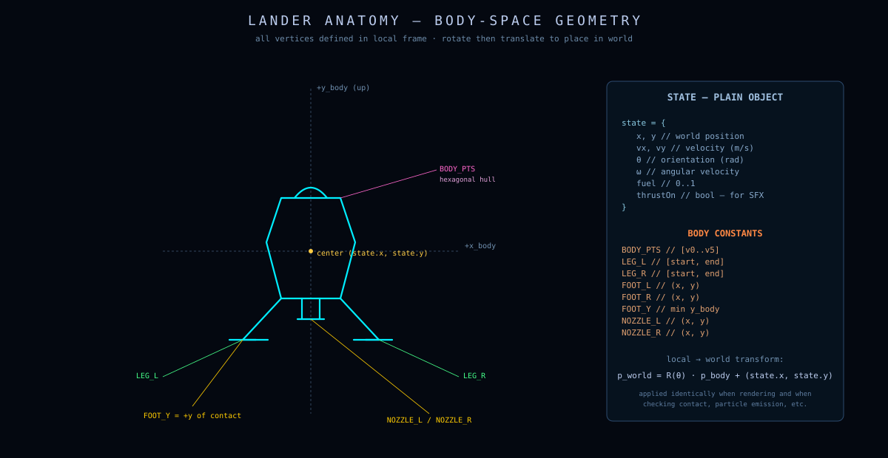
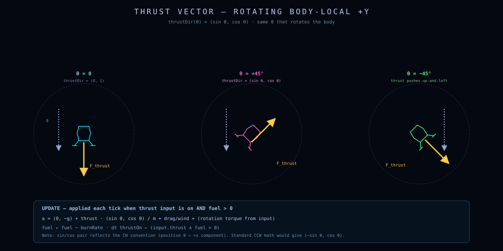
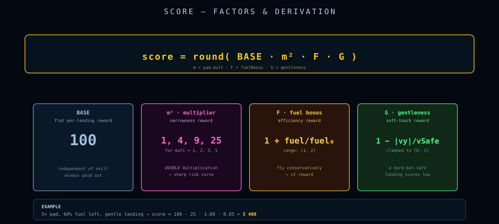
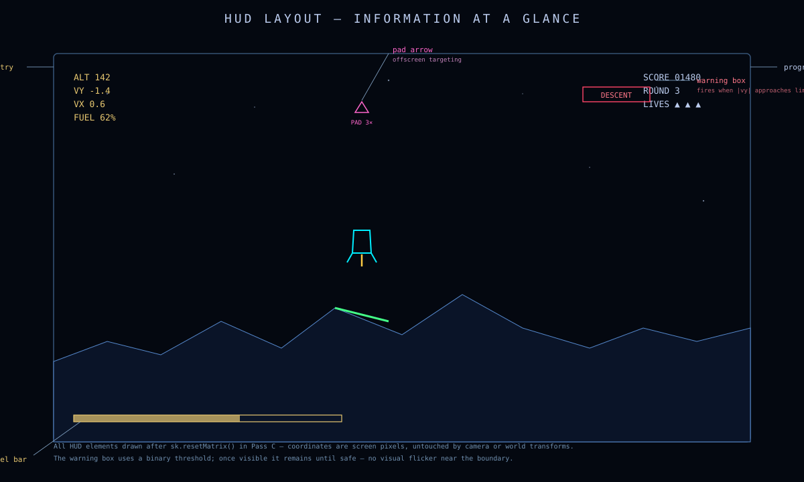

# The Lander

> Six body points, two leg segments, one nozzle, one nose vector.
> This document is the anatomical reference for the lander mesh, how it transforms into the world, and how its score is computed on a safe touchdown.

---

## Table of contents

- [Geometry](#geometry)
- [Local → world transform](#local-to-world-transform)
- [Thrust and nozzle](#thrust-and-nozzle)
- [Spawn profiles](#spawn-profiles)
- [Scoring](#scoring)
- [The HUD warning state](#the-hud-warning-state)
- [Lives, rounds, and respawn](#lives-rounds-and-respawn)

---

## Geometry

The lander is a hard-coded polygon in **local lander coordinates** — `S` is the global scale (currently `1.1`), and all coordinates are Y-up.

```js
const S = 1.1;

const BODY_PTS = [
    { x:  0.00,      y:  0.72 * S },   // 0  nose
    { x:  0.38 * S,  y:  0.28 * S },   // 1  shoulder right
    { x:  0.44 * S,  y: -0.32 * S },   // 2  hip right
    { x:  0.00,      y: -0.50 * S },   // 3  base centre
    { x: -0.44 * S,  y: -0.32 * S },   // 4  hip left
    { x: -0.38 * S,  y:  0.28 * S },   // 5  shoulder left
];

const LEG_L = [{ x: -0.44 * S, y: -0.32 * S }, { x: -0.78 * S, y: -0.82 * S }];
const LEG_R = [{ x:  0.44 * S, y: -0.32 * S }, { x:  0.78 * S, y: -0.82 * S }];

const FOOT_Y    = -0.82 * S;            // lowest leg tip y-coord (world contact reference)
const NOZZLE_L  = { x: -0.16 * S, y: -0.50 * S };
const NOZZLE_R  = { x:  0.16 * S, y: -0.50 * S };
```

<p align="center">
  
</p>

### Bounding properties

| Property | Value | Use |
|---|---|---|
| Total height | `0.72·S − FOOT_Y = 1.54·S = 1.694` world units | Render-only scale check |
| Half-width (hip) | `0.44·S = 0.484` | Visual estimate of "horizontal extent" |
| Foot Y | `-0.82·S = -0.902` | Single-point ground contact test |
| Nozzle gap | `0.32·S = 0.352` | Flame triangle base width |

`SHIP_HEIGHT_WORLD` is precomputed so the camera's render-scale check stays cheap:

```js
const SHIP_HEIGHT_WORLD =
    Math.max(...BODY_PTS.map(p => p.y)) -
    Math.min(FOOT_Y, ...BODY_PTS.map(p => p.y));
```

---

## Local to world transform

A local lander-frame point $\mathbf{p}_L = [p_x, p_y]^T$ becomes a world point $\mathbf{p}_W$ via rotation around the origin (the lander's center) followed by translation to the lander's world position:

$$
\mathbf{p}_W \;=\; R(\theta)\,\mathbf{p}_L \;+\; \mathbf{c}
$$

with the rotation matrix from [`docs/physics.md`](physics.md#rotation-sign-convention):

$$
R(\theta) \;=\; \begin{bmatrix} \cos\theta & \sin\theta \\ -\sin\theta & \cos\theta \end{bmatrix}.
$$

In code:

```js
const rotPt = (p, theta) => {
    const c = Math.cos(theta), s = Math.sin(theta);
    return { x: p.x * c + p.y * s, y: -p.x * s + p.y * c };
};

const toWorld = (pts, cx, cy, theta) =>
    pts.map(p => { const r = rotPt(p, theta); return { x: r.x + cx, y: r.y + cy }; });
```

The renderer applies a **render-only scale** $s_r \ge 1$ to the local points before transforming, when the lander would otherwise be smaller than `MIN_SHIP_PIXELS = 22` on screen:

```js
const bodyPts = BODY_PTS.map(p => scalePt(p, renderScale));
// ...
neonPoly(sk, toWorld(bodyPts, cx, cy, theta), colorProfile.ship.outline, pixelToWorld, 1.5, true);
```

This scale **never** propagates to `FOOT_Y`, contact detection, or particle emission. Those use the unscaled geometry.

---

## Thrust and nozzle

The thrust direction is the unit nose vector:

$$
\hat{\mathbf{n}}(\theta) = \begin{bmatrix}\sin\theta\\ \cos\theta\end{bmatrix}
$$

Exhaust goes the other way:

$$
\hat{\mathbf{e}}(\theta) = -\hat{\mathbf{n}}(\theta) = \begin{bmatrix}-\sin\theta\\ -\cos\theta\end{bmatrix}.
$$

The nozzle (where the flame emerges) is a point slightly below the body base in local coordinates:

```js
const nozzleWorld = (s, renderScale = 1) => {
    const nozzle = rotPt(scalePt({ x: 0, y: FOOT_Y * 0.54 }, renderScale), s.theta);
    return { x: s.pos[0] + nozzle.x, y: s.pos[1] + nozzle.y };
};
```

Note: nozzle y is `FOOT_Y * 0.54 ≈ -0.486` — halfway down the legs, sitting just below the body base. Not at the foot tips.

<p align="center">
  
</p>

The flame is rendered as a thin triangle:

```js
const tipLocal = { x: jitter, y: FOOT_Y * 0.5 * renderScale - jetDepth };
const tip      = rotPt(tipLocal, theta);
neonPoly(sk, [wNL, wTip, wNR], colorProfile.effects.flame,     pixelToWorld, 3.0, false); // outer glow
neonPoly(sk, [wNL, wTip, wNR], colorProfile.effects.flameCore, pixelToWorld, 1.2, false); // bright core
```

The `jetDepth = flameLen · 1.6 · S` value comes from a smoothed throttle:

```js
flameLen = actualThrottle > 0
    ? flameLen + (actualThrottle - flameLen) * Math.min(1, dt * 18)
    : 0;
```

This first-order smoothing makes the flame grow over ~3 frames when the engine lights, and snap to zero instantly when fuel runs out or thrust releases.

---

## Spawn profiles

A round begins by selecting a spawn profile and choosing an interesting spawn x-coordinate.

### The four profiles

```js
const SPAWN_PROFILES = [
    { name: 'EASY',      vy: -2.5, vxRange: 0.0, fuel: 100, altitude: 75  },
    { name: 'NORMAL',    vy: -3.5, vxRange: 0.5, fuel: 95,  altitude: 95  },
    { name: 'HARD',      vy: -5.0, vxRange: 1.0, fuel: 85,  altitude: 110 },
    { name: 'CHALLENGE', vy: -7.0, vxRange: 2.0, fuel: 75,  altitude: 125 },
];
```

The lander starts **already descending**. This was a deliberate decision — a zero-velocity spawn would feel like the game hasn't started. Even on EASY, $v_y = -2.5$ m/s is already at the safe-landing limit, so the first input the player needs is *thrust*.

`vxRange` is the half-width of a deterministic random initial $v_x$. EASY locks $v_x = 0$; CHALLENGE can drift up to ±2 m/s.

### Choosing the spawn x

`chooseSpawnX(rand, profile)` picks an x that **shows interesting terrain**:

```js
candidates = [
    midpoints between every adjacent pad pair,
    centers of every multiplier-≥-2 pad (with jitter),
    lowest terrain point in the chunk (gorge floor),
    highest terrain point in the chunk (ridge),
    midpoint of low and high,
];
```

Each candidate is scored by a penalty for clipping the top of the world:

```js
const topPenalty = Math.max(0, groundY + profile.altitude - (win.top - 8));
score = topPenalty * 20 + rand();
```

We sort by score and pick uniformly from the top few. The result: spawn points consistently appear above or between interesting terrain features — gorges, ridges, or pad clusters — rather than over featureless flatland.

---

## Scoring

Scoring is a four-term sum, all multiplied by the pad's difficulty multiplier:

$$
\boxed{
\mathrm{score} \;=\; \mathrm{pad.mult} \cdot \bigl( B + b_f \cdot f + b_p \cdot \rho \cdot \mathrm{pad.mult} + b_s \cdot \sigma \cdot \mathrm{pad.mult} \bigr)
}
$$

where

| Symbol | Meaning | Value |
|---|---|---|
| $B$ | base score | 1000 |
| $b_f$ | fuel bonus per remaining unit | 8 |
| $b_p$ | max precision bonus | 500 |
| $b_s$ | max softness bonus | 300 |
| $\rho \in [0,1]$ | precision factor (1 at pad center, 0 at edge) | computed |
| $\sigma \in [0,1]$ | softness factor (1 at $v_y = 0, \theta = 0$, 0 at thresholds) | computed |

In code:

```js
const fuelBonus = Math.round(s.fuel * FUEL_BONUS_PER);
const padCentre = (pad.x1 + pad.x2) * 0.5;
const padHalfW  = (pad.x2 - pad.x1) * 0.5;
const precBonus = Math.round(
    Math.max(0, 1 - Math.abs(s.pos[0] - padCentre) / padHalfW) * PRECISION_BONUS * pad.multiplier
);
const vyFraction  = Math.max(0, 1 - Math.abs(s.vel[1]) / V_SAFE_Y);
const angFraction = Math.max(0, 1 - Math.abs(s.theta) / THETA_SAFE);
const softBonus   = Math.round(vyFraction * angFraction * SOFTNESS_BONUS * pad.multiplier);

return (BASE_SCORE + fuelBonus + precBonus + softBonus) * pad.multiplier;
```

### The two implicit `pad.mult` factors

Note that precision and softness each get multiplied by `pad.mult` **before** the outer multiplication. This means an EXPERT (5×) pad's *bonus* portion is multiplied by 5² = 25, while the base + fuel bonuses are only ×5. So:

- **Base** scales linearly with difficulty.
- **Skill bonuses** scale quadratically with difficulty.

This is a deliberate "risk multiplier on a risk multiplier" effect — perfect-center landings on a 5× pad are worth ~25× a baseline EASY pad-edge landing.

<p align="center">
  
</p>

### Confetti stinger

A bonus audio sting plays on any landing that satisfies *both* of the following extra-strict criteria:

```js
if (Math.abs(state.pos[0] - padCentre) < padHalfW * 0.25 &&
    Math.abs(state.vel[1]) < V_SAFE_Y * 0.4) {
    SFX?.playRandom(['confetti1', 'confetti2']);
}
```

- Within 25% of the pad half-width from center.
- Vertical speed under 1.0 m/s (40% of safe).

A "celebratory" version of the safe-landing sound. Players quickly learn that this stinger means "you landed like a pro."

---

## The HUD warning state

The HUD continuously evaluates the lander state and reports a single-word warning:

```js
const warning = (() => {
    if (!state)                                                                          return 'NO SIGNAL';
    if (state.fuel <= 0)                                                                 return 'OUT OF FUEL';
    if (Math.abs(state.vel[1]) > V_SAFE_Y)                                               return 'DESCENT RATE';
    if (Math.abs(state.vel[0]) > V_SAFE_X)                                               return 'LATERAL DRIFT';
    if (Math.abs(state.theta) > THETA_SAFE)                                              return 'LEAN';
    if (!findPadUnder(terrain, state.pos[0]) && Number(altAboveGround) < 16)             return 'NO PAD';
    return 'NOMINAL';
})();
```

Priority order: fuel → descent → drift → lean → pad coverage. Each check is the same predicate that `classifyTouchdown` uses, applied *in flight* rather than at impact, so the HUD tells the player what would happen if they touched down right now. This converts the box safety region into actionable, single-word advice.

In addition, three colored dots on the right side of the HUD show $v_y$, $v_x$, and $\theta$ status independently (green / red). Together with the one-word warning, the player has both a summary and a breakdown.

<p align="center">
  
</p>

---

## Lives, rounds, and respawn

The round/lives logic is small and lives at the top of `update(dt)`:

```js
let lives = 3;        // initial

// On crash:
lives -= 1;
phase = 'crashed';

// Wait RESET_DELAY = 3.0s, then:
if (lives > 0) startRound(/* newSeed=phase==='landed' */);
else           phase = 'gameover';
```

A few subtle rules:

1. **A safe landing earns a *new* seed.** `startRound(true)` regenerates the terrain. This is to prevent farming the same easy pad over and over.
2. **A crash *keeps* the seed.** `startRound(false)` regenerates the lander state and particles but not the terrain. The player gets a second (and third) try on the same geography. This is critical for skill development.
3. **Hi-score persists across game-overs** within the page session. Pressing **R** resets score and lives but keeps `hiScore`.

The state-machine diagram is in [`docs/architecture.md`](architecture.md#state-machine).
