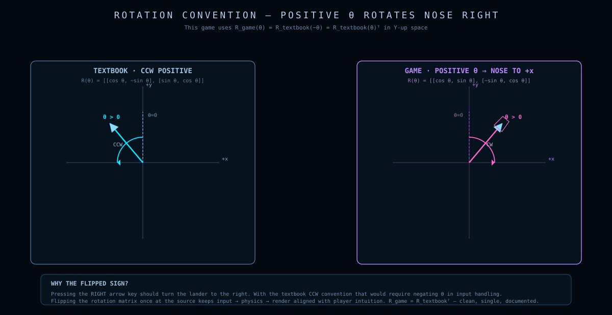
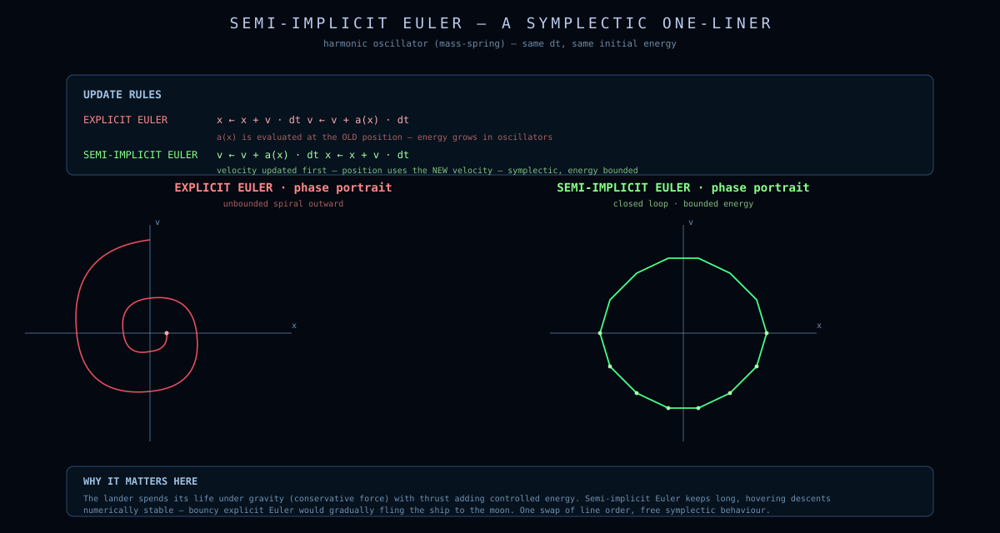
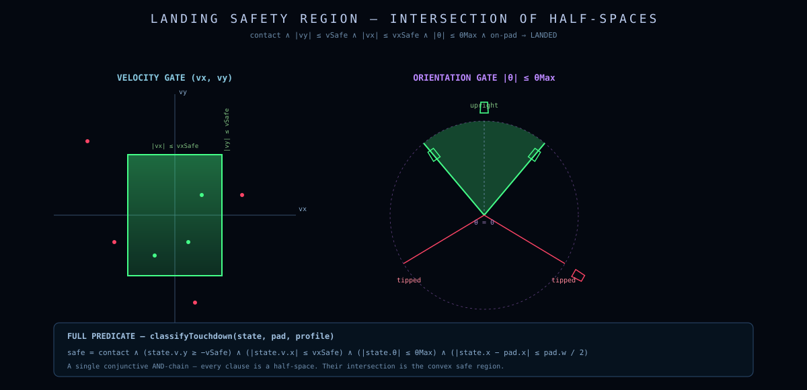
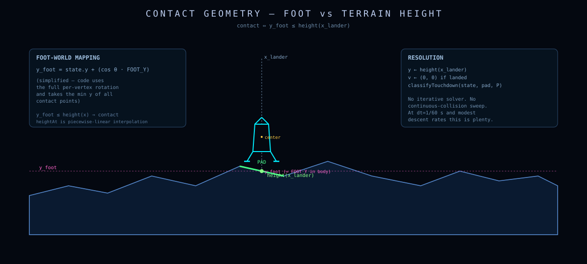

# Physics

> Five state variables, one ODE step, one safety predicate.
> This document derives the equations of motion from Newton's laws, explains the choice of integrator, and proves the landing predicate is a half-space safety region.

---

## Table of contents

- [State](#state)
- [Equations of motion](#equations-of-motion)
- [The rotation convention, in full](#rotation-sign-convention)
- [Semi-implicit Euler](#semi-implicit-euler)
- [Continuous-time damping](#continuous-time-damping)
- [Fuel and the throttle invariant](#fuel-and-the-throttle-invariant)
- [The landing predicate](#the-landing-predicate)
- [Ground contact](#ground-contact)
- [Why not RK4?](#why-not-rk4)

---

## State

The dynamics module (`lander-dynamics.js`) is **pure data in, pure data out**. The state is a plain object with five fields:

```js
{
  pos:   [x, y],     // world position (meters), Y-up
  vel:   [vx, vy],   // linear velocity (m/s)
  theta: number,     // attitude angle (rad)
  omega: number,     // angular velocity (rad/s)
  fuel:  number,     // remaining propellant (arcade units, dimensionless)
}
```

Input is similarly minimal:

```js
{
  thrust:   bool,    // ↑ or SPACE
  rotLeft:  bool,    // ←
  rotRight: bool,    // →
}
```

No mass field — variable-mass dynamics are a v2 extension (see [the design brief](../README.md#engineering-philosophy)). For v1, engine acceleration is a constant.

---

## Equations of motion

The lander is treated as a point mass with one rotational degree of freedom. The state-space ODE is:

$$
\begin{aligned}
\dot{\mathbf{p}} &= \mathbf{v} \\
\dot{\mathbf{v}} &= \mathbf{g} + \tau\,a_T\,\hat{\mathbf{n}}(\theta) \;-\; k_d\,(\mathbf{v} - \mathbf{w}) \\
\dot{\theta}     &= \omega \\
\dot{\omega}     &= \alpha_{\text{rcs}}\,(I_R - I_L) \;-\; k_\omega\,\omega \\
\dot{f}          &= -\tau\,r_b
\end{aligned}
$$

where

| Symbol | Meaning | Value (Moon) |
|---|---|---|
| $\mathbf{p}$ | position (m) | initial condition |
| $\mathbf{v}$ | velocity (m/s) | initial condition |
| $\mathbf{g}$ | gravity vector (m/s²) | $[0, -1.62]$ |
| $\hat{\mathbf{n}}(\theta)$ | nose direction (unit vector) | $[\sin\theta, \cos\theta]$ |
| $a_T$ | engine acceleration at full throttle (m/s²) | 5.0 |
| $\tau \in \{0,1\}$ | effective throttle (binary in v1) | 0 or 1 |
| $k_d$ | linear drag coefficient (1/s) | 0 |
| $\mathbf{w}$ | wind velocity (m/s) | $[0, 0]$ |
| $\theta$ | attitude angle (rad), 0 = nose +Y | initial condition |
| $\omega$ | angular velocity (rad/s) | initial condition |
| $\alpha_{\text{rcs}}$ | RCS angular acceleration (rad/s²) | 7.0 |
| $I_L, I_R$ | left/right RCS booleans (0 or 1) | from input |
| $k_\omega$ | angular damping rate (1/s) | 1.9 |
| $f$ | fuel (units) | starts at 100 |
| $r_b$ | burn rate (units/s) | 7.0 |

The state-space form makes the ODE block-structured:

$$
\frac{d}{dt}\begin{bmatrix}\mathbf{p}\\ \mathbf{v}\\ \theta\\ \omega\\ f\end{bmatrix}
= 
\underbrace{\begin{bmatrix}
\mathbf{v}\\
\mathbf{g} - k_d(\mathbf{v}-\mathbf{w})\\
\omega\\
-k_\omega\omega\\
0
\end{bmatrix}}_{\text{drift}}
+\;
\underbrace{\tau \begin{bmatrix} \mathbf{0}\\ a_T\,\hat{\mathbf{n}}(\theta)\\ 0\\ 0\\ -r_b\end{bmatrix}}_{\text{engine}}
+\;
\underbrace{(I_R-I_L) \begin{bmatrix} \mathbf{0}\\ \mathbf{0}\\ 0\\ \alpha_{\text{rcs}}\\ 0\end{bmatrix}}_{\text{RCS}}
$$

Engine input and RCS input are independent controls. There is no aerodynamic torque, no engine-misalignment torque, and no off-axis thrust — keeping the model fun and predictable.

---

## Rotation sign convention

This is the convention every diagram, equation, and piece of code in the repo respects:

```
World:    +X right, +Y up   (Cartesian)
Attitude: θ = 0    nose points +Y       (straight up)
          θ > 0    nose rotates toward +X  (visually: right)
          θ < 0    nose rotates toward −X  (visually: left)
Input:    LEFT  → ω decreases
          RIGHT → ω increases
Thrust:   T̂(θ) = [sin θ, cos θ]   (always equals displayed nose direction)
```

<p align="center">
  
</p>

### The rotation matrix used in the code

The code's `rotPt(p, θ)` maps a *local* lander-frame point to *world* coordinates:

```js
const rotPt = (p, theta) => {
    const c = Math.cos(theta), s = Math.sin(theta);
    return { x: p.x * c + p.y * s, y: -p.x * s + p.y * c };
};
```

Written as a matrix, this is:

$$
R(\theta) \;=\;
\begin{bmatrix}\cos\theta & \sin\theta \\ -\sin\theta & \cos\theta\end{bmatrix}
$$

Applied to the local nose point $[0,\,1]^T$:

$$
R(\theta)\begin{bmatrix}0 \\ 1\end{bmatrix}
= \begin{bmatrix}\sin\theta \\ \cos\theta\end{bmatrix}
= \hat{\mathbf{n}}(\theta).
$$

✅ At $\theta = 0$ this is $[0, 1]$ (nose up). At $\theta = +\pi/2$ this is $[1, 0]$ (nose right). Good.

### Why this rotation matrix is "the other one"

In a math textbook, the standard 2D rotation matrix is

$$
R_{\text{math}}(\theta) =
\begin{bmatrix}\cos\theta & -\sin\theta \\ \sin\theta & \cos\theta\end{bmatrix}
$$

which rotates a point **counter-clockwise** by $\theta$ in a Y-up frame. The code uses the transpose of this:

$$
R(\theta) \;=\; R_{\text{math}}(\theta)^T \;=\; R_{\text{math}}(-\theta).
$$

So the code's `R(θ)` is in fact a **clockwise** rotation of magnitude $\theta$ in our Y-up world. This is a deliberate game-design choice: it makes the **right** arrow key (input `rotRight`, producing positive angular acceleration) rotate the nose **to the right** on screen. The intuition stays one-to-one with the keys.

A skeptical reader can verify by hand: applying $R(+\pi/4)$ to the nose $[0,1]$ gives $[\sqrt{2}/2,\,\sqrt{2}/2]$ — up-and-to-the-right, exactly as the visual suggests.

> **Invariant** (any future contributor must preserve this):
> `thrustDir(theta)` *must equal* the displayed nose direction.
> `LEFT` *must* rotate the visual nose left.
> `RIGHT` *must* rotate the visual nose right.

---

## Semi-implicit Euler

The integrator is **semi-implicit Euler** (a.k.a. symplectic Euler):

$$
\boxed{
\begin{aligned}
\mathbf{v}_{t+\Delta t} &= \mathbf{v}_t + \mathbf{a}(\mathbf{p}_t, \theta_t)\,\Delta t \\
\mathbf{p}_{t+\Delta t} &= \mathbf{p}_t + \mathbf{v}_{t+\Delta t}\,\Delta t \\[4pt]
\omega_{t+\Delta t}     &= \omega_t + \alpha_{t}\,\Delta t \\
\theta_{t+\Delta t}     &= \theta_t + \omega_{t+\Delta t}\,\Delta t
\end{aligned}
}
$$

Note the **subscript on the right-hand side of the position update**: velocity is updated *first*, then position uses the **new** velocity. This is the semi-implicit step. In explicit Euler the position would use $\mathbf{v}_t$ instead; in fully-implicit Euler both updates would use $\mathbf{v}_{t+\Delta t}$.

<p align="center">
  
</p>

The implementation reads almost line-for-line:

```js
const ax = tau * ENGINE_ACCEL * td[0] - drag * relVx;
const ay = -gravity + tau * ENGINE_ACCEL * td[1] - drag * relVy;

const vx1 = vel[0] + ax * dt;          // v ← v + a·dt
const vy1 = vel[1] + ay * dt;
const x1  = pos[0] + vx1 * dt;         // p ← p + v_new · dt
const y1  = pos[1] + vy1 * dt;

const rcsInput = (input.rotRight ? RCS_ALPHA : 0) - (input.rotLeft ? RCS_ALPHA : 0);
let omega1 = omega + rcsInput * dt;    // ω ← ω + α·dt
omega1 *= Math.exp(-OMEGA_DAMPING_RATE * dt);
omega1  = clamp(omega1, -OMEGA_MAX, OMEGA_MAX);
const theta1 = theta + omega1 * dt;    // θ ← θ + ω_new · dt
```

### Why semi-implicit Euler?

Semi-implicit Euler is *symplectic*: it conserves a discrete approximation to total mechanical energy. For pure gravitational-orbit problems it produces stable, bounded orbits even at large time-steps where explicit Euler spirals outward and fully-implicit Euler spirals inward.

For an arcade lander the symplectic property matters less than two more practical wins:

1. **Game feel.** Position uses the *new* velocity, so thrust takes effect on position within the same frame. The lander responds to inputs without the one-frame lag explicit Euler would introduce.
2. **Simplicity.** It costs the same as explicit Euler. No Jacobian, no Newton iteration.

The cost: it is first-order. Truncation error per step is $O(\Delta t^2)$. With our cap of $\Delta t \le 0.05$ s and forces bounded by gravity plus engine, that error is negligible at the gameplay scale (millimeters per frame).

---

## Continuous-time damping

Frame-rate-independent damping is the second-most-important physics invariant in the codebase (after the rotation convention).

The angular damping ODE is:

$$
\dot\omega = -k_\omega\,\omega \;\Rightarrow\; \omega(t+\Delta t) = \omega(t)\,e^{-k_\omega\,\Delta t}
$$

This exponential solution is *exact*. Discretizing with `omega *= exp(-k*dt)` produces the same answer at any `dt`. By contrast, `omega *= 0.92` is a per-frame multiply that bakes in an assumed `dt = 1/60`:

```js
// ❌ frame-rate dependent
omega *= 0.92;

// ✅ frame-rate independent — the only acceptable form
omega *= Math.exp(-OMEGA_DAMPING_RATE * dt);
```

The same pattern applies to the camera smoothing and to debris drag throughout the codebase. **No frame-dependent constants exist anywhere in physics, audio gating, or particles.**

---

## Fuel and the throttle invariant

The throttle is a binary control gated by fuel:

$$
\tau(\text{state}, \text{input}) = \begin{cases}
1 & \text{if } f > 0 \text{ and input.thrust} \\
0 & \text{otherwise}
\end{cases}
$$

```js
export const effectiveThrottle = (state, input) =>
    (state.fuel > 0 && input.thrust) ? 1.0 : 0.0;
```

Why is this its own function? Because **the same** $\tau$ must drive five separate subsystems simultaneously:

```
                          ┌─→ physics thrust  (a_T · n̂)
                          ├─→ fuel burn       (df/dt)
effectiveThrottle(s,i) ──→├─→ flame rendering (jet length)
                          ├─→ engine sound    (loop on/off)
                          └─→ HUD throttle    (percent)
```

If even one of these reads `input.thrust` directly instead of going through `effectiveThrottle`, you get bugs of the form "engine sound keeps playing after fuel runs out" or "flame visible without thrust applied." The single source of truth pattern is non-negotiable.

Fuel decays linearly:

$$
f_{t+\Delta t} = \max\!\bigl(0,\; f_t - \tau\,r_b\,\Delta t\bigr)
$$

At full burn ($\tau=1$, $r_b=7$, $f_0=100$) the tank empties in ~14 seconds. This is intentionally short: the player should never feel they have *enough* fuel.

---

## The landing predicate

Touchdown classification is a **half-space safety region** in five-dimensional state space. The lander lands safely if and only if all five inequalities hold simultaneously:

$$
\boxed{
\begin{aligned}
|v_y| &\le V_{\text{safe},y} = 2.5 \text{ m/s} \\
|v_x| &\le V_{\text{safe},x} = 1.5 \text{ m/s} \\
|\theta| &\le \Theta_{\text{safe}} \approx 0.26 \text{ rad} \,\,(\approx 15°)\\
|\omega| &\le \Omega_{\text{safe}} = 0.5 \text{ rad/s} \\
\text{pad.x1} \le p_x &\le \text{pad.x2}
\end{aligned}
}
$$

<p align="center">
  
</p>

In code (verbatim from `lander-dynamics.js`):

```js
export const classifyTouchdown = (state, pad) => {
    if (!pad)                                    return 'crash';  // not over a pad
    if (Math.abs(state.vel[1]) > V_SAFE_Y)       return 'crash';  // sinking too fast
    if (Math.abs(state.vel[0]) > V_SAFE_X)       return 'crash';  // drifting sideways
    if (Math.abs(state.theta) > THETA_SAFE)      return 'crash';  // leaning too far
    if (Math.abs(state.omega) > OMEGA_SAFE)      return 'crash';  // spinning
    if (state.pos[0] < pad.x1 ||
        state.pos[0] > pad.x2)                   return 'crash';  // missed the pad
    return 'safe';
};
```

The order of checks is irrelevant for correctness — all five are necessary. The code orders them by what's most likely to be wrong (no pad → crashing way too fast → drifting → leaning → spinning → just off the pad edge), which makes log output during debugging more readable.

### Why a box and not a sphere?

A spherical safety region (e.g. $\|(\nu v_y, \mu v_x, \lambda \theta, ...)\| \le 1$) would be more "physically meaningful" in some sense. But:

- **Players reason in coordinates.** "I need to slow down" and "I need to straighten out" are independent skills. A box lets them be tuned independently.
- **The HUD reflects the box.** Three colored dots show $v_y$, $v_x$, $\theta$ status independently. A sphere would require an aggregate readout, which is harder to act on.
- **Tuning is cheap.** Four constants (`V_SAFE_Y`, `V_SAFE_X`, `THETA_SAFE`, `OMEGA_SAFE`) is the smallest tunable surface area possible.

If we ever switch to a smoother score function (e.g. precision bonus already does this), we keep the box for the hard predicate and use a smooth function only for the bonus.

---

## Ground contact

Contact detection is a single comparison performed every physics step:

```js
const footLocal = { x: 0, y: FOOT_Y };               // local leg-tip
const footRot   = rotPt(footLocal, state.theta);     // rotate into world
const footWorldY = state.pos[1] + footRot.y;
const groundY    = heightAt(terrain, state.pos[0]);

if (footWorldY <= groundY) {
    // Touchdown
}
```

`FOOT_Y` is the local y-coordinate of the lowest leg tip (`-0.82 · S` where `S = 1.1`). When the lander is upright (`θ ≈ 0`), the world Y of the foot is just `pos.y + FOOT_Y`. As the lander tilts, the foot swings:

<p align="center">
  
</p>

The contact test uses a *single* point (the centerline foot, not both legs). This is a deliberate simplification: full polygon-vs-polyline collision would be more "correct" but would gate landing on legs touching simultaneously, which makes a perfectly-vertical touchdown at zero velocity sometimes register as a single-leg crash. The single-point test, combined with `THETA_SAFE`, gives an extremely forgiving landing window that still requires the lander to actually be upright.

On touchdown, the state is snapped to rest:

```js
const overlap = groundY - footWorldY;
state = {
    ...state,
    pos: [state.pos[0], state.pos[1] + overlap],  // lift up onto surface
    vel: [0, 0],
    omega: 0,
};
```

…and then `classifyTouchdown(state, pad)` decides the verdict. **Important**: the snap happens *before* classification, but the safety predicate uses the pre-snap velocity (which is `state.vel` *at the moment of contact*, captured implicitly because we only snap velocity after we've already detected contact). The pre-snap velocity is what matters — it's the impact, not the rest state.

---

## Why not RK4?

Runge-Kutta 4 is the most popular high-order integrator in graphics. It evaluates the derivative four times per step at carefully chosen mid-points to achieve $O(\Delta t^4)$ truncation error. So why don't we use it?

| Need | Semi-implicit Euler | RK4 |
|---|---|---|
| Stability at large `dt` for orbits | symplectic ✓ | drifts ✗ |
| Stability at large `dt` for damped systems | ✓ | ✓ |
| Handles discontinuous controls (binary thrust, RCS toggles) | ✓ trivially | needs care: intermediate stages may sample a control during a transition |
| Handles per-frame collisions | ✓ — solve, then test | awkward — intermediate stages can cross the ground |
| Per-step cost | 1× derivative eval | 4× derivative eval |
| Game feel — control responds same frame | ✓ | ✓ but more lag-prone with sub-stepping |
| Reads like the textbook ODE | ✓ exactly | obscured by stage interpolation |

For continuous, smooth ODEs (a planet orbiting a star with no inputs), RK4 is a clear win. For a lander with binary inputs and per-frame collision testing, semi-implicit Euler is **both faster and clearer**.

RK4 is still a good choice elsewhere in the canon — see the spring simulation and orbit demos. For the lander, semi-implicit Euler is correct.

---

## Summary

The entire physics module is ~75 lines. It's intentionally tiny. Everything else — terrain, particles, profiles, audio — exists to support these few equations.

```js
// The entire ODE step.
export const step = (state, input, dt, env = {}) => {
    const { pos, vel, theta, omega, fuel } = state;
    const gravity = env.gravity ?? G_MOON;
    const drag    = env.drag    ?? 0;
    const wind    = env.wind    || [0, 0];

    const tau = effectiveThrottle(state, input);
    const td  = [Math.sin(theta), Math.cos(theta)];

    const ax = tau * ENGINE_ACCEL * td[0] - drag * (vel[0] - wind[0]);
    const ay = -gravity + tau * ENGINE_ACCEL * td[1] - drag * (vel[1] - wind[1]);

    const vx1 = vel[0] + ax * dt;
    const vy1 = vel[1] + ay * dt;
    const x1  = pos[0] + vx1 * dt;
    const y1  = pos[1] + vy1 * dt;

    const rcsInput = (input.rotRight ? RCS_ALPHA : 0) - (input.rotLeft ? RCS_ALPHA : 0);
    let omega1 = omega + rcsInput * dt;
    omega1 *= Math.exp(-OMEGA_DAMPING_RATE * dt);
    omega1  = Math.max(-OMEGA_MAX, Math.min(OMEGA_MAX, omega1));
    const theta1 = theta + omega1 * dt;

    return {
        pos:   [x1, y1],
        vel:   [vx1, vy1],
        theta: theta1,
        omega: omega1,
        fuel:  Math.max(0, fuel - tau * BURN_RATE * dt),
    };
};
```

If you read the equations at the top of this document and then read this function, they should be the same object expressed twice. That's the resemblance principle.
