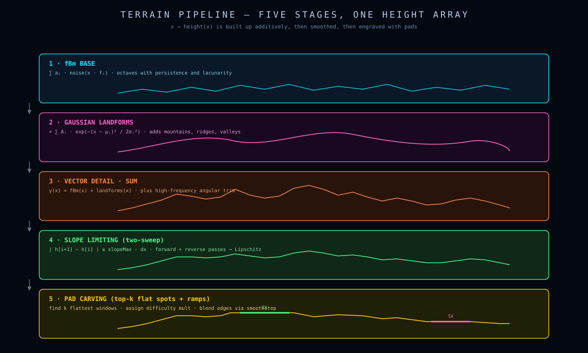
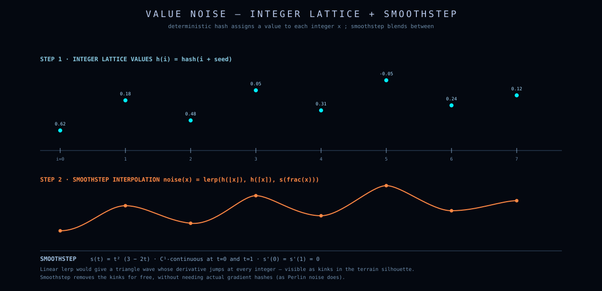
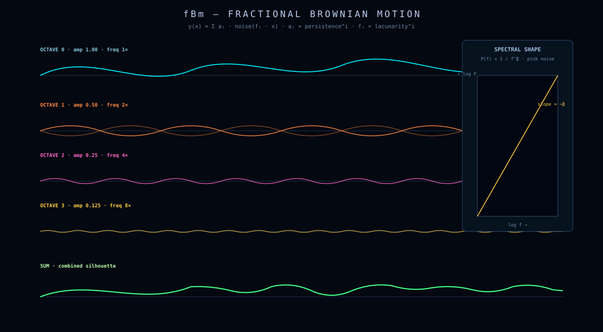
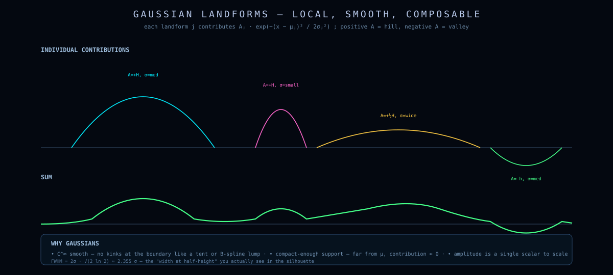
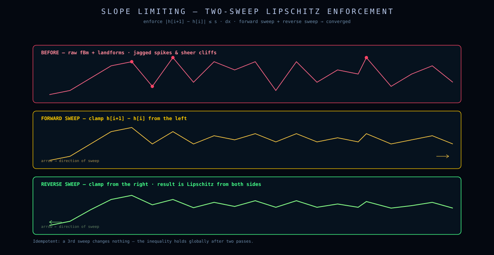
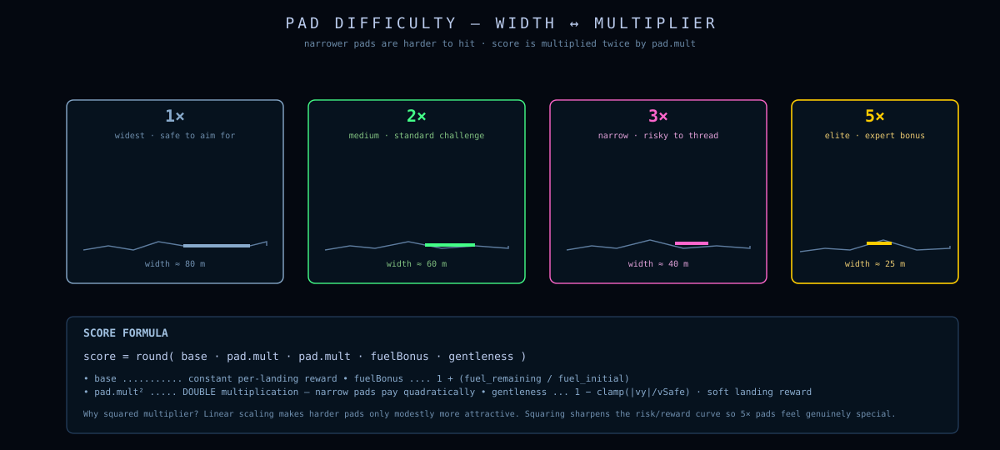
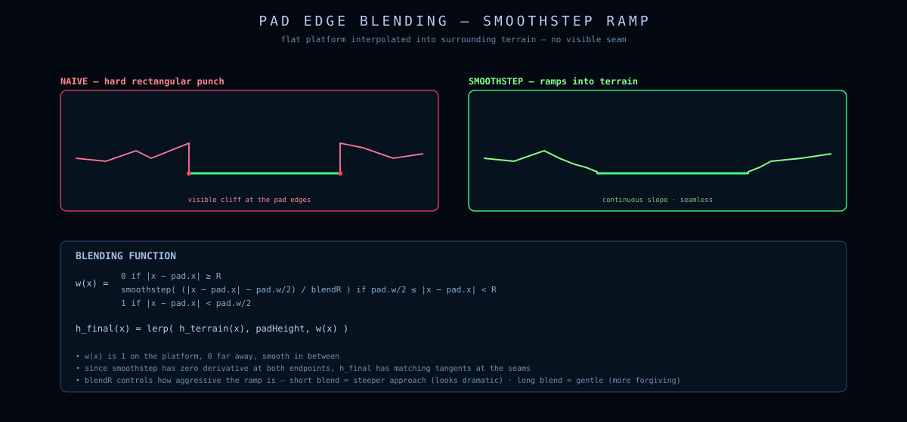
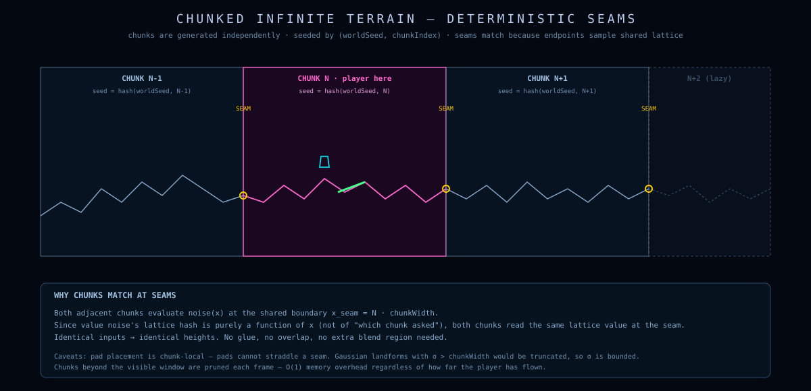

# Terrain

> The terrain is a 1-dimensional heightmap rendered as a polyline.
> Beneath that simple surface is a five-stage pipeline: fBm base texture, Gaussian landform sculpting, vector detail, slope limiting, and pad carving.
> The whole thing is deterministic from a single integer seed, and it tiles infinitely sideways.

---

## Table of contents

- [Why a heightmap?](#why-a-heightmap)
- [The five-stage pipeline](#the-five-stage-pipeline)
- [Stage 1 — Value noise + fBm](#stage-1--value-noise--fbm)
- [Stage 2 — Gaussian landforms](#stage-2--gaussian-landforms)
- [Stage 3 — Vector detail](#stage-3--vector-detail)
- [Stage 4 — Slope limiting](#stage-4--slope-limiting)
- [Stage 5 — Landing pads](#stage-5--landing-pads)
- [Chunked infinite terrain](#chunked-infinite-terrain)
- [Queries](#queries)
- [Complexity](#complexity)

---

## Why a heightmap?

A 1D heightmap $h(x)$ is the smallest representation that supports everything we need:

- Render as a polyline with `sk.beginShape() … sk.endShape()`.
- Sample height anywhere with piecewise-linear interpolation in $O(\log n)$ (we use $O(n)$ — fine at our scales).
- Carve flat pads by overwriting heights in a span.
- Slope-limit to prevent vertical cliffs.

Full 2D contour terrain (cave-like overhangs, polygonal landmasses) would be more expressive but would not improve gameplay — the lander never needs to fly *under* anything. The heightmap encodes everything `Lunar Lander` ever needed.

<p align="center">
  
</p>

---

## The five-stage pipeline

Each chunk is generated by `generateChunk(seed, baseWin, chunkWidth, chunkIndex)`. The chunk consists of `N+1 = 120..160` evenly-spaced samples spanning the chunk width.

```text
              ┌─────────────────────────────────────────────────┐
              │ Stage 1: fBm base texture                       │
              │   y_i = yMid + (fBm(u) − ½)·2·H·0.16            │
              │   broad, gentle, can't make canyons by itself   │
              └────────────────┬────────────────────────────────┘
                               │
              ┌────────────────▼────────────────────────────────┐
              │ Stage 2: Gaussian landforms                     │
              │   subtract main gorge (depth 0.45..0.60·H)      │
              │   subtract secondary gorge (depth 0.28..0.42·H) │
              │   add two flanking mountains (height 0.25..0.45·H) │
              └────────────────┬────────────────────────────────┘
                               │
              ┌────────────────▼────────────────────────────────┐
              │ Stage 3: Vector detail                          │
              │   y_i += (fBm(detail·16) − ½)·2·H·0.035         │
              │   small angular notches, never the silhouette  │
              └────────────────┬────────────────────────────────┘
                               │
              ┌────────────────▼────────────────────────────────┐
              │ Stage 4: Slope limiting + flat-span break-up    │
              │   |Δy_i| ≤ maxDelta (forward then backward)    │
              │   wobble plateaus that aren't pads             │
              └────────────────┬────────────────────────────────┘
                               │
              ┌────────────────▼────────────────────────────────┐
              │ Stage 5: Pad carving                            │
              │   for each pad type:                            │
              │     score candidates (shelf-flatness + altitude)│
              │     pick from top window, flatten, blend edges  │
              └─────────────────────────────────────────────────┘
```

---

## Stage 1 — Value noise + fBm

### Value noise

We use a tiny precomputed table of 256 random samples and smoothstep-interpolate between them:

```js
const valueNoise1D = (randValues, x) => {
    const i = Math.floor(x);
    const t = x - i;
    const n = randValues.length;
    const a = randValues[((i % n) + n) % n];
    const b = randValues[(((i + 1) % n) + n) % n];
    return lerp(a, b, smoothstep(t));
};
```

The interpolation function is the cubic smoothstep:

$$
S(t) = 3t^2 - 2t^3
$$

It has $S(0) = 0$, $S(1) = 1$, and $S'(0) = S'(1) = 0$ — so the noise is C¹ continuous, no visible kinks at integer x.

<p align="center">
  
</p>

### Fractal Brownian motion (fBm)

A single octave of value noise is too smooth and self-similar. fBm sums multiple octaves at progressively higher frequencies and lower amplitudes:

$$
\mathrm{fBm}(x) = \frac{1}{Z}\sum_{i=0}^{n-1} A^i \cdot \mathrm{noise}\!\bigl(2^i \cdot x\bigr),
\qquad Z = \sum_{i=0}^{n-1} A^i
$$

with persistence $A = 0.5$ and $n = 5$ octaves. The normalizer $Z$ keeps the output in roughly $[0,1]$ regardless of how many octaves we use.

```js
const fbm1D = (noise, x, octaves = 5) => {
    let amp = 1, freq = 1, sum = 0, norm = 0;
    for (let i = 0; i < octaves; i++) {
        sum  += amp * noise(x * freq);
        norm += amp;
        amp  *= 0.5;
        freq *= 2;
    }
    return sum / norm;
};
```

<p align="center">
  
</p>

### Why fBm alone is not enough

The base shape uses fBm with **amplitude 16% of vertical range**:

```js
const heights = xs.map((_, i) => {
    const u = i / N;
    const base = (fbm1D(noise, baseOffset + u * 1.7, 5) - 0.5) * 2;
    return yMid + base * H * 0.16;     // only 16% of H!
});
```

Why only 16%? Because fBm is statistically *self-similar*: it makes rolling hills, not 60%-deep canyons. Past experiments cranking fBm amplitude up produced "shallow rolling hills with random noise on top," not Lunar Lander terrain.

The cinematic gorges and mountains come from **Stage 2**, not from fBm.

---

## Stage 2 — Gaussian landforms

This is the stage that gives the terrain its cinematic, dangerous feel. We place a small number of explicit features and add or subtract a Gaussian bump per feature:

$$
G(x; c, w) = \exp\!\left(-\frac{(x-c)^2}{2w^2}\right)
$$

Each chunk gets:

- **1 main gorge**: depth $\in [0.45,\,0.60]\,H$, width $\in [0.10,\,0.18]\,W$, centered at $x \in [L + 0.38W,\,L + 0.62W]$.
- **1 secondary gorge**: depth $\in [0.28,\,0.42]\,H$, placed on the opposite side of the main gorge.
- **2 flanking mountains**: height $\in [0.25,\,0.45]\,H$, placed roughly $0.20\,W$ to either side of the main gorge.

```js
for (let i = 0; i < heights.length; i++) {
    const x = xs[i];
    heights[i] -= mainGorge.depth      * gaussian(x, mainGorge.cx,      mainGorge.width);
    heights[i] -= secondaryGorge.depth * gaussian(x, secondaryGorge.cx, secondaryGorge.width);
    for (const m of mountainFeatures)
        heights[i] += m.height         * gaussian(x, m.cx,              m.width);
}
```

<p align="center">
  
</p>

The composition is linear (add and subtract), so the final shape is fully predictable from the parameters. There are no marching-cubes-style discontinuities; every shape is a smooth Gaussian.

### Why Gaussians?

Three reasons:

1. **Localized**. Each landform affects only a small neighborhood. A gorge centered at $x = 30$ with $w = 12$ has essentially zero effect at $x = 80$.
2. **Smooth.** Gaussians are $C^\infty$. Combined with the slope-limit step, this means no vertical cliffs.
3. **One-parameter intuition.** Width and depth are both linear knobs. A width-12 width-24 gorge looks like a wider version of the width-12. There's no mode where the shape "flips" qualitatively.

We could equally use cosines or B-spline bumps. Gaussians are easiest to reason about.

---

## Stage 3 — Vector detail

After the big shapes are in place, we add a second pass of high-frequency fBm — but capped at $3.5\%$ of $H$:

```js
for (let i = 0; i < heights.length; i++) {
    const u = i / N;
    const detail = (fbm1D(noise, detailOffset + u * 16.0, 4) - 0.5) * 2;
    heights[i] = clamp(heights[i] + detail * H * 0.035, yFloor, yCeil);
}
```

Note the frequency multiplier: `u * 16.0` instead of Stage 1's `u * 1.7`. Roughly 10× finer detail. This creates the angular notches and small variations that make the silhouette look like vector hand-drawn terrain rather than a smooth digital curve.

---

## Stage 4 — Slope limiting

After Stages 1–3, neighboring samples can have large height jumps if a Gaussian bump fell sharply at the edges. We enforce a maximum slope between adjacent samples:

$$
|\,h_{i+1} - h_i\,| \le \Delta_{\max} = 0.18\,H
$$

The implementation runs a **forward sweep** and then a **backward sweep**:

```js
const limitSlopes = (heights, maxDeltaY) => {
    // Forward sweep: each height can't exceed its left neighbor by more than maxDeltaY
    for (let i = 1; i < heights.length; i++) {
        heights[i] = clamp(heights[i],
                           heights[i - 1] - maxDeltaY,
                           heights[i - 1] + maxDeltaY);
    }
    // Backward sweep: same thing from the right
    for (let i = heights.length - 2; i >= 0; i--) {
        heights[i] = clamp(heights[i],
                           heights[i + 1] - maxDeltaY,
                           heights[i + 1] + maxDeltaY);
    }
};
```

The two-sweep approach gives a tent-shaped projection onto the feasible set: any height that violated the constraint gets brought down to the most extreme value allowed by *both* its neighbors.

<p align="center">
  
</p>

The choice of $\Delta_{\max} = 0.18 H$ is the maximum vertical drop between two adjacent samples. With $H = 160$ and ~140 samples ($dx \approx 1.7$ world units), that's a maximum slope of about $0.18 \cdot 160 / 1.7 \approx 17$ — roughly a 17-meter drop in 1.7 horizontal meters, or ~84° from horizontal. That's still very steep, just shy of vertical. Good — we want dangerous slopes that *aren't* completely impossible to skim.

### Breaking up flat spans

There's also a separate pass that detects accidental plateaus (multiple adjacent identical heights) and adds tiny random wobbles to them — *unless* they're a pad:

```js
breakFlatSpans(heights, rand, yFloor, yCeil, range, padMask);
```

This keeps the silhouette feeling like procedural terrain and not like a rectified test pattern. Pads, which are *supposed* to be flat, are masked out.

---

## Stage 5 — Landing pads

Pads are the most subtle part of the pipeline. The challenge is making them feel like natural shelves carved into the rock, not rectangular notches glued on after the fact.

### The four pad types

```js
const padTypes = [
    { difficulty: 'EASY',   label: '1X', multiplier: 1, widthFrac: 0.035 },
    { difficulty: 'MEDIUM', label: '2X', multiplier: 2, widthFrac: 0.026 },
    { difficulty: 'HARD',   label: '3X', multiplier: 3, widthFrac: 0.019 },
    { difficulty: 'EXPERT', label: '5X', multiplier: 5, widthFrac: 0.014 },
];
```

Each pad has a width as a fraction of chunk width. EASY pads are about 2.5× wider than EXPERT pads, so a 5× expert pad asks for substantially more precision.

<p align="center">
  
</p>

### Candidate scoring

For each pad type, we generate all valid candidate spans (sliding window of `widthCols` samples, skipping the chunk edges and any region already occupied by another pad) and score each one:

```js
const stats     = localSlopeStats(start, end);
const shelfScore = stats.avgSlope + stats.maxSlope * 2.0 + approachJump * 0.7;
```

`shelfScore` is a "how naturally flat is this region" metric — lower is better. The pad scoring then combines `shelfScore` with an altitude preference unique to each tier:

```js
if (type.difficulty === 'EASY')   return shelfScore * 2.8 + |alt - 0.18|·H·0.35;
if (type.difficulty === 'MEDIUM') return shelfScore * 2.1 + |alt - 0.45|·H·0.16;
if (type.difficulty === 'HARD')   return shelfScore * 1.6 + |alt - 0.67|·H·0.12 - ridgeScore·H·0.04;
return                                   shelfScore * 1.2 + |alt - 0.78|·H·0.09 - ridgeScore·H·0.09;
```

The pattern:

| Tier | Prefers | shelf-weight | altitude target | ridge bonus |
|---|---|---|---|---|
| EASY | Naturally flat areas | high (2.8) | low — gorge floor (alt 0.18) | none |
| MEDIUM | Mid-altitude shelves | mid (2.1) | mid (alt 0.45) | none |
| HARD | High narrow shelves | low (1.6) | high (alt 0.67) | small reward (−0.04) |
| EXPERT | Exposed ridges, possibly awkward terrain | lowest (1.2) | very high (alt 0.78) | strong reward (−0.09) |

Lower difficulty pads prefer naturally easy approach geometry. Higher difficulty pads accept (and prefer!) ridges where the surrounding terrain is *not* naturally flat — that's what makes them dangerous.

### Pick from the top window

After sorting candidates by score, we pick uniformly at random from the top `pickWindow` (3 for EASY, 6 for harder tiers). This makes each round feel different even when the surrounding terrain doesn't change much.

### Carving and blending

Once the pad is chosen, the carve operation flattens its interior and blends the two endpoints into the surrounding terrain:

```js
// Center heights are set to the chosen pad altitude
for (let i = start; i <= end; i++) heights[i] = padY;

// Two samples on each side blend toward padY at 60%/25% weight
if (start > 0)     heights[start - 1] = clamp(lerp(heights[start - 1], padY, 0.60), padY - maxΔ, padY + maxΔ);
if (start > 1)     heights[start - 2] = lerp(heights[start - 2], padY, 0.25);
if (end < N)       heights[end   + 1] = clamp(lerp(heights[end   + 1], padY, 0.60), padY - maxΔ, padY + maxΔ);
if (end < N - 1)   heights[end   + 2] = lerp(heights[end   + 2], padY, 0.25);
```

<p align="center">
  
</p>

The result: a flat pad in the middle, short steep ramps on either side, and a smooth transition back to natural terrain after 2 samples. No rectangular cliffs.

### A small dose of awkwardness for hard pads

Pads with `multiplier ≥ 3` get a small intentional perturbation in their altitude:

```js
const awkward = type.multiplier >= 3 ? (rand() - 0.5) * range * 0.08 : 0;
const padY    = clamp(baseY + awkward, yFloor + H * 0.035, yCeil - H * 0.035);
```

This randomly shifts hard/expert pad altitudes up to ±8% of range away from their natural shelf position, making them harder to reach and more visually striking. EASY and MEDIUM pads stay perfectly at the natural shelf altitude.

---

## Chunked infinite terrain

The world is wider than what fits on screen. We generate one **chunk** at a time, where each chunk is the full `win` width. Chunks are indexed by integer:

```text
   chunk -2    chunk -1    chunk  0    chunk  1    chunk  2
[─────────][─────────][═════════][═════════][═════════]
                            ▲
                       initial spawn
```

Each chunk's seed is a deterministic mix of the round seed and the chunk index:

```js
const mixSeed = (seed, chunkIndex) =>
    (Math.imul(seed >>> 0, 1103515245) ^ Math.imul(chunkIndex | 0, 2654435761)) >>> 0;
```

So flying off to the right always produces the same terrain for a given `roundSeed`, but neighboring chunks have independent streams (different `mixSeed` values) so they don't share patterns.

### Seam matching

When `getChunk(i)` runs and its neighbors (`i-1`, `i+1`) already exist, we patch the first/last vertex of the new chunk to match the touching vertex of its neighbor:

```js
if (prev) chunk.vertices[0].y                       = prev.vertices[prev.vertices.length - 1].y;
if (next) chunk.vertices[chunk.vertices.length-1].y = next.vertices[0].y;

if (prev || next) {
    const heights = chunk.vertices.map(v => v.y);
    // ...patch endpoints again, then re-run limitSlopes...
    limitSlopes(heights, maxDeltaY);
}
```

This guarantees: **no vertical seams between chunks**, no matter the order you generate them in. Slope-limiting after patching propagates the constraint a few samples deep so the seam region is smooth, not stitched.

<p align="center">
  
</p>

### Visible terrain query

For rendering, the demo asks for the visible window:

```js
export const getVisibleTerrain = (terrain, win) => {
    const first = chunkIndexForX(terrain, win.left)  - 1;
    const last  = chunkIndexForX(terrain, win.right) + 1;
    const vertices = [];
    const pads     = [];

    for (let idx = first; idx <= last; idx++) {
        const chunk = terrain.getChunk(idx);
        // accumulate, deduplicating shared edge vertices
    }
    return { vertices, pads };
};
```

`getVisibleTerrain` always queries one extra chunk on each side so that the polyline is never cut off mid-segment as the camera scrolls.

---

## Queries

Two queries are used during the game loop:

### Height sampling — `heightAt(terrain, x)`

Piecewise-linear interpolation between adjacent vertices:

$$
h(x) = h_i + t\,(h_{i+1} - h_i),\quad t = \frac{x - x_i}{x_{i+1} - x_i}
$$

```js
export const heightAt = (terrain, x) => {
    const chunk = terrain.getChunk(chunkIndexForX(terrain, x));
    const v = chunk.vertices;
    if (x <= v[0].x)           return v[0].y;
    if (x >= v[v.length-1].x)  return v[v.length-1].y;
    for (let i = 0; i < v.length - 1; i++) {
        if (x >= v[i].x && x <= v[i + 1].x) {
            const t = (x - v[i].x) / (v[i + 1].x - v[i].x);
            return v[i].y + t * (v[i + 1].y - v[i].y);
        }
    }
};
```

Linear search is $O(n)$ but $n < 200$ per chunk and it's called once per frame for the lander + once per frame for camera + once per impact-burst — fine. If profiled-hot, a binary search would drop this to $O(\log n)$.

### Pad lookup — `findPadUnder(terrain, x)`

```js
export const findPadUnder = (terrain, x) => {
    const chunk = terrain.getChunk(chunkIndexForX(terrain, x));
    for (const pad of chunk.pads)
        if (x >= pad.x1 && x <= pad.x2) return pad;
    return null;
};
```

Each chunk has 1–4 pads, so this loop is essentially $O(1)$.

---

## Complexity

For a chunk of $N+1$ samples:

| Stage | Cost |
|---|---|
| fBm base | $O(N \cdot \text{octaves}) = O(5N)$ |
| Gaussian landforms | $O(N \cdot \text{features}) = O(4N)$ |
| Vector detail | $O(N \cdot 4)$ |
| Slope limiting (two sweeps) | $O(N)$ |
| Break flat spans | $O(N)$ |
| Pad candidate generation | $O(N \cdot \text{padTypes}) = O(4N)$ |
| Pad scoring + sort | $O(N \log N)$ per pad type |

Total: **$O(N \log N)$ per chunk**, with $N \approx 140$. On modern hardware each chunk takes well under a millisecond, and chunks are generated on demand and cached.

Memory per chunk: ~$120 \cdot 16$ bytes for vertices + a few pad records + cached randoms ≈ **3 KB**. The infinite world's memory grows linearly with how far the player has flown — at the rate of 3 KB per ~240 world units. A million chunks would be 3 GB; the player will not fly that far.
