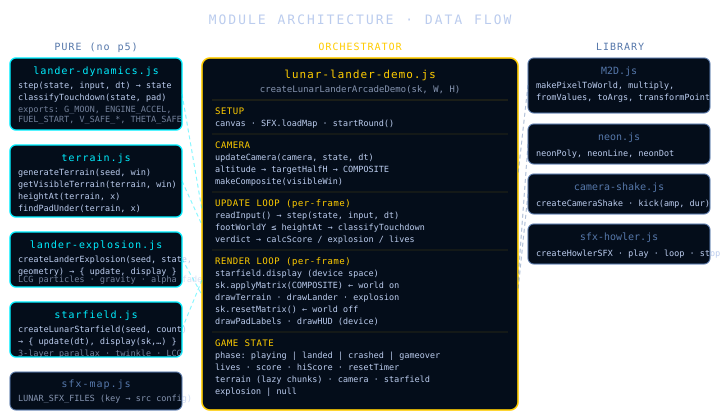
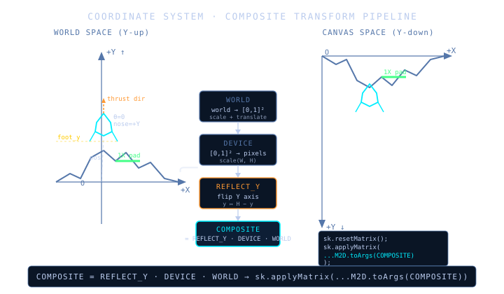
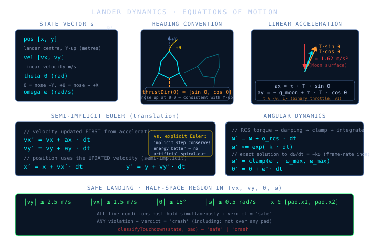
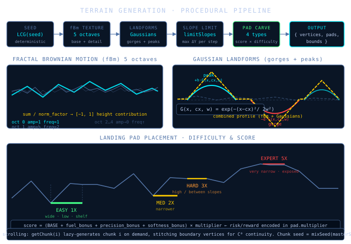

# Lunar Lander — Technical Documentation

> *The implementation should resemble the mathematical object that generated it.*

---

## Contents

1. [Motivation](#1-motivation)
2. [Architecture](#2-architecture)
3. [Coordinate System](#3-coordinate-system)
4. [Lander Dynamics](#4-lander-dynamics)
5. [Terrain Generation](#5-terrain-generation)
6. [Camera System](#6-camera-system)
7. [Explosion System](#7-explosion-system)
8. [Cinematic Particle Systems](#8-cinematic-particle-systems)
9. [Starfield](#9-starfield)
10. [Color Profiles](#10-color-profiles)
11. [Planet Profiles](#11-planet-profiles)
12. [Game Loop & State Machine](#12-game-loop--state-machine)
13. [Score Model](#13-score-model)
14. [Engineering Decisions](#14-engineering-decisions)
15. [Manual Verification](#15-manual-verification)
16. [Complexity](#16-complexity)

---

## 1. Motivation

The Lunar Lander is a physics arcade game whose essential drama is a **control problem**: you must bring a body governed by Newtonian mechanics to rest inside a narrow half-space defined by velocity, angle, and position constraints, while managing a finite fuel supply. Every system in this codebase serves that core tension.

The game also provides a natural vehicle for several ideas the repository cares about:

| Idea | Where it appears |
|---|---|
| Explicit ODEs | `lander-dynamics.js` — equations read like the physics |
| Procedural generation | `terrain.js` — fBm + Gaussians + constraint solvers |
| Coordinate transforms | COMPOSITE pipeline — Y-up world into Y-down canvas |
| Emergent difficulty | pad placement scoring — geography creates risk |
| Separation of concerns | pure physics / pure terrain / orchestrating demo |

---

## 2. Architecture



The codebase is split into **pure modules** (no p5, no side effects) and a single **orchestrator** that wires them together.

```
lander-dynamics.js   ─┐
terrain.js           ─┤
lander-explosion.js  ─┼──►  lunar-lander-demo.js  ──►  p5 canvas
lunar-particles.js   ─┤
starfield.js         ─┤
color-profiles.js    ─┤
planet-profiles.js   ─┤
environment-effects.js ┤
neon-debris.js      ───┤
sfx-map.js           ─┘
```

**The boundary is intentional.** Pure modules are independently testable and reusable. The orchestrator handles: world construction, game state, the update/render loop, camera, input, audio, and HUD. It imports everything it needs; nothing imports it.

---

## 3. Coordinate System



`docs/lunar-lander-design.md` is the authoritative source for coordinate, attitude, control, thrust, and transform invariants. This document summarizes those invariants for implementation context, but future convention disputes should be resolved against the design brief.

### 3.1 The Problem

p5.js (and the HTML Canvas beneath it) uses **Y-down** device space: pixel (0, 0) is top-left and Y increases downward. Physics, however, is most naturally expressed in **Y-up** space where gravity points in the −Y direction and angles follow the standard mathematical convention.

Rendering in device space directly would require negating Y at every formula boundary — error-prone and conceptually noisy. Instead, the codebase maintains Y-up world coordinates throughout and resolves the flip once via a composite transform.

### 3.2 The COMPOSITE Transform

Three matrices compose the pipeline:

```
COMPOSITE = REFLECT_Y · DEVICE · WORLD
```

| Matrix | Responsibility |
|---|---|
| `WORLD` | Maps world window → normalised [0, 1]² viewport. |
| `DEVICE` | Maps [0, 1]² → canvas pixels via `scale(W, H)`. |
| `REFLECT_Y` | Flips the Y axis: `y ↦ H − y`. |

In code (`M2D.js` affine 3×3 in column-major):

```js
const sw = 1 / (visibleWin.right  - visibleWin.left);
const sh = 1 / (visibleWin.top    - visibleWin.bottom);
const tw = -visibleWin.left   * sw;
const th = -visibleWin.bottom * sh;
const WORLD    = M2D.fromValues(sw, 0, 0, sh, tw, th);
const DEVICE   = M2D.fromValues(W,  0, 0, H,  0,  0);
const REFLECT_Y = M2D.fromValues(1,  0, 0, -1, 0,  H);
const COMPOSITE = M2D.multiply(M2D.multiply(REFLECT_Y, DEVICE), WORLD);
```

Applied once per frame:

```js
sk.resetMatrix();
sk.translate(shakeOffsetX, shakeOffsetY);
sk.applyMatrix(...M2D.toArgs(COMPOSITE));
// ← all subsequent drawing is in Y-up world space
```

### 3.3 Heading Convention

The lander's orientation `theta` is defined so that **`theta = 0` means the nose points in the +Y direction**. The thrust direction vector is therefore:

```
thrustDir(θ) = [sin θ, cos θ]
```

This is consistent with the Y-up convention: at `theta = 0`, thrust is `[0, 1]` (upward). Positive `theta` rotates the nose toward +X (rightward lean). Negative `theta` rotates toward −X (leftward lean).

Local geometry rotation uses the same convention:

```js
const rotPt = (p, theta) => {
    const c = Math.cos(theta), s = Math.sin(theta);
    return { x: p.x * c + p.y * s, y: -p.x * s + p.y * c };
};
```

Verify: `rotPt({ x:0, y:1 }, 0)` → `{ x:0, y:1 }` ✓ (nose up at `theta=0`).

---

## 4. Lander Dynamics



`lander-dynamics.js` is a pure function file. It takes a state and returns a new state. **No p5 calls, no mutation, no side effects.**

### 4.1 State

```
s = { pos: [x, y], vel: [vx, vy], theta, omega, fuel }
```

All coordinates are in Y-up world space (metres). `theta` is in radians; `omega` in rad/s.

### 4.2 Equations of Motion

The lander is modelled as a rigid body under two forces: gravity and thrust.

**Linear acceleration:**

```
ax = τ · T · sin θ
ay = −g_planet + τ · T · cos θ
```

Where:
- `τ ∈ {0, 1}` — binary throttle (v1; variable mass is a v2 extension)
- `T = ENGINE_ACCEL = 5.0 m/s²` — peak thrust acceleration
- `g_planet` — read explicitly from the active planet profile

The gravity term is always present. Thrust opposes it only along the lander's axis. Moon remains the default profile (`1.62 m/s²`), so omitting planet options preserves the original dynamics.

Atmospheric drag is also explicit profile data:

```
a_drag = -drag · (vel - wind)
```

Collision, scoring, terrain geometry, fuel rules, and landing predicates do not read planet visual state.

### 4.3 Semi-Implicit Euler Integration

```
vx′ = vx + ax · dt        ← velocity updated first
vy′ = vy + ay · dt
x′  = x  + vx′ · dt      ← position uses the UPDATED velocity
y′  = y  + vy′ · dt
```

This is **semi-implicit Euler** (also called symplectic Euler). The distinction from explicit Euler is that position is integrated using the velocity *after* the force step — one line of code, but consequential for stability.

**Why semi-implicit?** Explicit Euler integrates position with the old velocity, which introduces an artificial energy gain over time — a spring will slowly expand, a pendulum will spiral outward. Semi-implicit Euler is symplectic: it preserves a modified Hamiltonian, so energy is bounded. For an arcade lander over the timescales involved, the difference is modest but the correct form is strictly better and no more expensive.

### 4.4 Angular Dynamics

Rotation uses a three-step process per frame:

```
1. ω′  = ω + α_rcs · dt           (RCS torque input)
2. ω′ ×= exp(−k · dt)              (exponential damping)
3. ω′  = clamp(ω′, −ω_max, ω_max) (hard speed limit)
4. θ′  = θ + ω′ · dt              (integrate angle)
```

**Step 2 is exact, not approximate.** The continuous-time ODE `dω/dt = −k·ω` has the analytic solution `ω(t) = ω₀ · e^(−kt)`. Discretised for one step of size `dt`:

```
ω(t + dt) = ω(t) · exp(−k · dt)
```

This is **frame-rate independent** at any legal `dt`. A common shortcut `omega *= 0.92` is subtly wrong — it bakes in an assumed frame rate and produces different damping at 30 fps vs 60 fps. The exponential form is the same cost and correct by construction.

### 4.5 Safe Landing Predicate

```
classifyTouchdown(state, pad) → 'safe' | 'crash'
```

All five conditions must hold simultaneously. This defines a **half-space region** in the state manifold:

```
│vy│ ≤ V_SAFE_Y  (2.5 m/s)    — not sinking too fast
│vx│ ≤ V_SAFE_X  (1.5 m/s)    — not drifting sideways
│θ│  ≤ THETA_SAFE (≈ 15°)     — not leaning too far
│ω│  ≤ OMEGA_SAFE (0.5 rad/s) — not spinning
x ∈ [pad.x1, pad.x2]          — actually over a pad
```

If no pad exists under the lander, `pad = null` and the result is immediately `'crash'`. This is the correct default: landing on terrain that isn't a pad is always a crash.

### 4.6 Fuel

Fuel is dimensionless (0–100) and depleted at `BURN_RATE · τ · dt` per step. It is bounded below by zero. When fuel reaches zero, `effectiveThrottle` returns 0 regardless of the thrust key, and `ENGINE_ACCEL` contributes nothing.

---

## 5. Terrain Generation



`terrain.js` generates a **procedural, infinitely-scrolling 1D heightmap** with carved landing pads. The terrain is a polyline in Y-up world coordinates — no Bézier curves, no smoothing outside the generator.

### 5.1 Deterministic LCG

All randomness flows from a seeded Linear Congruential Generator:

```js
const lcg = (seed) => {
    let s = seed >>> 0;
    return () => {
        s = (Math.imul(s, 1664525) + 1013904223) >>> 0;
        return s / 0x100000000;
    };
};
```

Constants are the classic Numerical Recipes parameters. `Math.imul` gives correct 32-bit integer overflow behaviour in JS. The same seed always produces the same terrain — essential for debugging and for chunk stitching.

### 5.2 Value Noise and fBm

1D value noise samples a table of 256 LCG values and interpolates between adjacent entries using a **smoothstep** polynomial `t² (3 − 2t)`. This is C¹ continuous (zero derivative at endpoints), giving visually smooth noise without visible discontinuities between table entries.

**Fractal Brownian Motion** (fBm) sums `n` octaves at geometrically increasing frequencies and halving amplitudes:

```
fBm(x) = Σᵢ (½)ⁱ · noise(2ⁱ · x)   normalized by Σᵢ (½)ⁱ
```

With 5 octaves the terrain has broad rolling hills (from low frequencies) textured by fine angular detail (from high frequencies). The fine detail is `~3.5%` of the total height range — small enough not to dominate the silhouette.

### 5.3 Gaussian Landforms

fBm alone produces statistically uniform terrain — no gorges, no dramatic peaks. Explicit Gaussian functions are added to create **narrative geography**:

```
G(x, cx, w) = exp(−(x − cx)² / 2w²)
```

Each chunk gets:
- **One main gorge** — subtracted, depth `45–60%` of height range, positioned off-centre
- **One secondary gorge** — subtracted, depth `28–42%`, positioned on the opposite side
- **Two mountain peaks** — added, flanking the main gorge

This reliably produces the silhouette visible in the screenshot: a central valley flanked by mountains with a secondary depression elsewhere. The gorges are the navigational hazard — they force the player to descend into a confined space to reach low-multiplier pads.

### 5.4 Slope Limiting

After the Gaussian pass, adjacent sample deltas are clamped to `maxDeltaY = 18%` of the height range. This is applied as a two-pass forward-and-backward sweep:

```js
// forward pass
heights[i] = clamp(heights[i], heights[i-1] - maxDeltaY, heights[i-1] + maxDeltaY)
// backward pass
heights[i] = clamp(heights[i], heights[i+1] - maxDeltaY, heights[i+1] + maxDeltaY)
```

This prevents vertical cliffs without smoothing the terrain. The angular polyline character is preserved — only the most extreme transitions are truncated.

### 5.5 Flat Span Breaking

After slope limiting, runs of identical-height samples are perturbed slightly with LCG noise. This prevents the terrain from having artificial flat plateaus in non-pad areas. Pad spans are excluded via a boolean mask (`padMask`) so their intentional flatness is never disturbed.

### 5.6 Landing Pad Placement

Four pad types are defined with increasing difficulty and score multiplier:

| Type | Width fraction | Multiplier | Target altitude |
|---|---|---|---|
| EASY | 3.5% of world width | 1× | Low (~18% height) |
| MEDIUM | 2.6% | 2× | Mid (~45%) |
| HARD | 1.9% | 3× | High (~67%) |
| EXPERT | 1.4% | 5× | Very high (~78%) |

For each type, the algorithm:

1. **Generates candidates** — every valid window of the required width that doesn't overlap an existing pad.
2. **Computes two scores per candidate:**
   - `shelfScore`: penalises local slope and approach jump — prefers existing flat shelves
   - `ridgeScore`: rewards ridge-top position — used by harder pads to place them in exposed spots
3. **Applies a type-specific scoring formula** combining these with altitude preference and an edge penalty.
4. **Selects** from the best `k` candidates with a small random component so the same terrain type isn't always at the same spot.

Pads are **carved** into the terrain: surrounding vertices are blended toward the pad's Y to form short natural-looking shelves rather than rectangular cuts. The pad itself is perfectly flat — this is intentional and visually reads as a landing platform.

### 5.7 Infinite Scrolling (Chunks)

The terrain is divided into chunks of width `(win.right − win.left)`. Each chunk is generated lazily on first access via `terrain.getChunk(i)`. The chunk seed is mixed from the master seed and the chunk index:

```js
const mixSeed = (seed, chunkIndex) =>
    (Math.imul(seed >>> 0, 1103515245) ^ Math.imul(chunkIndex | 0, 2654435761)) >>> 0;
```

Boundary continuity (C⁰) is enforced: when a new chunk is generated adjacent to an existing one, the boundary vertex Y-values are matched, then `limitSlopes` is re-run to avoid a sudden cliff at the seam.

`getVisibleTerrain(terrain, win)` returns only the vertices and pads visible in the current camera window, deduplicating boundary vertices to avoid double-drawing.

### 5.8 Queries

```js
heightAt(terrain, x)       // piecewise-linear interpolation
findPadUnder(terrain, x)   // returns pad | null
```

`heightAt` performs a linear scan of the relevant chunk's vertex array. For the typical chunk size (120–160 vertices), this is fast enough that binary search would be premature complexity.

---

## 6. Camera System

The camera is defined by `{ center: [x, y], halfH, targetHalfH }`. It is **smoothed** each frame via exponential approach (the discrete-time analogue of an RC low-pass filter):

```js
const alpha = 1 - Math.exp(-k · dt)
camera.center[x] += (target[x] - camera.center[x]) * alpha
camera.halfH      += (targetHalfH - camera.halfH) * alpha
```

Using `1 − exp(−k·dt)` rather than a fixed `alpha` makes the smoothing **frame-rate independent** — same convergence rate at 30 fps or 120 fps.

The camera zoom is altitude-driven:

```
altitude > 45 m  →  halfH ≈ 65–85  (zoomed out, see the gorge)
altitude 18–45 m →  halfH ≈ 42–65  (transitional)
altitude < 18 m  →  halfH ≈ 24–38  (zoomed in, precision landing)
```

Velocity adds a speed component to `halfH` and shifts the horizontal lead:

```js
const leadX = clamp(vel[0] * 1.25, -halfH * 0.7, halfH * 0.7)
```

This gives the player more forward vision when moving horizontally — a classic platformer technique. The camera is also Y-biased downward (`lookDown = halfH * yBias`) so the terrain occupies the lower portion of the frame and the sky gives fuel-burn headroom.

The `COMPOSITE` transform is rebuilt every frame from `cameraWin(camera)`, so the camera feeds directly into the coordinate pipeline with no special-case rendering code.

---

## 7. Explosion System

`lander-explosion.js` is a **vector particle system**. It decomposes the lander geometry (body polygon + two leg segments) into fragments, emits 34 spark points, and creates a short shock ring plus flash.

Each fragment:
- Inherits a fraction of the lander's velocity at impact (`× 0.45`)
- Gets an additional random burst velocity in a random direction
- Carries the two endpoints of its original segment in **local fragment space**
- Has an angular velocity `omega` for tumbling
- Has a lifetime `maxLife ∈ [1.0, 1.55]` seconds

Each spark:
- Inherits `× 0.25` of the lander's velocity
- Gets a random burst speed of 5–27 m/s
- Has lifetime `∈ [0.45, 1.0]` seconds

Both are integrated with gravity (`g_moon = 1.62 m/s²`) each frame. Alpha fades linearly as `life / maxLife`. Fragment segments are drawn twice — a wide orange outer glow, then a narrow bright yellow core — producing the neon line effect consistent with the rest of the renderer.

The LCG seed is mixed from the round seed, round number, event counter, and impact position. The explosion is deterministic for a replayable start, but separate crashes still get distinct scatter.

Explosion effects are render/state-machine side effects only. They do not mutate `pos`, `vel`, `theta`, `omega`, `fuel`, or any collision state after the crash verdict has been decided.

---

## 8. Cinematic Particle Systems

`lunar-particles.js` contains a small deterministic particle factory:

```js
createLunarParticles(seed) → {
  emitPlume,
  emitDust,
  emitLandingDust,
  emitPadPulse,
  flash,
  update,
  display,
  flashAlpha
}
```

The module owns plume particles, dust puffs, landing dust, pad glow pulses, and transient screen flash. It has no p5 dependency until `display(sk, pixelToWorld)`, keeping update logic reusable and deterministic.

### 8.1 Single Throttle Source

All engine-driven systems read the same value:

```js
actualThrottle = effectiveThrottle(state, input)
```

That value drives:
- physics thrust and fuel burn in `lander-dynamics.js`
- engine loop audio
- HUD throttle
- main engine plume
- near-ground dust emission
- render-only engine light

When fuel reaches zero, `effectiveThrottle` returns `0`; thrust acceleration, flame, plume emission, engine audio, and HUD throttle all stop from the same source.

### 8.2 Engine Plume

The engine plume emits from the lander nozzle in the opposite direction of thrust:

```
nose       = [sin(theta), cos(theta)]
exhaustDir = -nose
```

Particles use explicit `dt` and exponential damping. Size is converted through `pixelToWorld` at draw time so the plume remains readable across camera zoom levels without affecting physics or collision.

### 8.3 Dust Interaction

Dust emits only when:
- `actualThrottle > 0`
- the rotated foot point is close to terrain

The dust origin is near `heightAt(terrain, state.pos[0])`, and horizontal velocity responds to the exhaust direction. This makes the exhaust visibly interact with the surface while avoiding dust trails in open sky.

Safe landing emits a softer one-shot dust settling effect at pad height. This is decorative and does not alter touchdown classification.

### 8.4 Landing Pad Glow

Pad glow is based on a local approach score:

```
proximity_to_pad × proximity_to_ground × speed_quality × drift_quality × lean_quality
```

The glow color follows pad difficulty:

| Pad | Color role |
|---|---|
| 1X EASY | green |
| 2X MEDIUM | blue |
| 3X HARD | amber |
| 5X EXPERT | magenta |

The pad gets brighter when the lander is close, descending, centered, slow, and upright. The pad itself remains a flat terrain segment; glow is a render-only bloom pass using the existing neon visual language.

### 8.5 Dynamic Lighting

Lighting is intentionally stylized rather than physically correct:
- engine light flickers around the nozzle while `actualThrottle > 0`
- crash flash combines the explosion flash and particle flash into a device-space overlay
- pad glow blooms in world space before the terrain/pad core line is drawn

These passes are reset-scoped and do not leak draw state into the HUD.

---

## 9. Starfield

`starfield.js` implements a **three-layer parallax starfield** with twinkle animation.

Layers are defined by depth coefficient, density, brightness, and size:

```js
{ depth: 0.08, count: 48%, alpha: 80,  size: 1.0  }   // far background
{ depth: 0.18, count: 34%, alpha: 125, size: 1.25 }   // mid
{ depth: 0.34, count: 18%, alpha: 175, size: 1.6  }   // near foreground
```

Star positions are stored as fractions `[0, 1]`. Each frame, the camera position is used to compute a parallax drift that scrolls the starfield in proportion to `depth` — shallow stars barely move, near stars move visibly. The position is wrapped modulo screen size so stars tile seamlessly.

Twinkle is a per-star sinusoidal modulation `0.72 + 0.28 · sin(t · tw + phase)` with randomised rate `tw` and phase offset. The starfield renders **before** the world transform is applied (it stays in device space) because it should not scroll with the camera but rather with a different, shallower scale factor.

---

## 10. Color Profiles

`color-profiles.js` is the palette boundary. Renderer code asks for semantic colors:

```
ship.outline
pads.highRisk
hud.warning
particles.engineCore
effects.explosion
terrain.line
world.background
```

Hardcoded render colors belong only in color profiles. This keeps gameplay meaning separate from presentation: a 5X pad is `pads.expert`, not "magenta"; fuel low is `hud.fuelLow`, not a literal red.

Two immutable profiles exist initially:

| Profile | Purpose |
|---|---|
| `vectorLunar` | The restrained cinematic look: near-black sky, muted blue terrain, cyan ship, amber engine, pale HUD. |
| `gyrussNeon` | A brighter arcade look: purple-black void, electric cyan/cobalt terrain, cyan-white ship, white/yellow/orange/magenta engine, stronger controlled bloom. |

The profile helpers are:

```
createColorProfile(profile)
getColorProfile(id)
getNextColorProfile(id)
resolvePadTier(pad)
getPulse({ time, frequency, phase })
```

Profiles are frozen at module load and reused by reference. The active profile changes only on user input or planet switch; no profile objects, arrays, gradients, or buffers are allocated per frame.

Controls:

| Key | Effect |
|---|---|
| `C` | Cycle visual color profile during active flight. |
| `P` | Cycle planet profile during active flight. |

The HUD shows both current planet and current visual profile.

---

## 11. Planet Profiles

`planet-profiles.js` defines first-class environment profiles:

```
{ id, name, gravity, atmosphereDensity, drag, wind,
  terrainMaterial, hazards, visualProfileId, environmentFx, environment }
```

Current profiles:

| Planet | Physics hook | Visual/environment hook |
|---|---|---|
| Moon | `gravity=1.62`, no drag, no wind | crisp sparse cyan/white debris, occasional amber asteroid |
| Mars | stronger gravity, light drag, light wind | red/orange meteor energy and fireball tails |
| Titan | low gravity, dense atmosphere, stronger drag | amber/violet haze, slower debris, heavy glow |
| Io | low drag, volcanic semantics | aggressive cinders, fireballs, lava flicker |
| Europa | low drag, icy semantics | cyan crystal fragments, ice shard rain, aurora ribbons |

Only explicit physics fields affect dynamics:

```
step(state, input, dt, planetProfile)
```

`gravity`, `drag`, and `wind` influence acceleration. Visual fields drive `environment-effects.js`, which is deterministic, bounded, and render-only. Meteors, ice rain, aurora ribbons, haze, volcanic glow, labels, and debris warning logs are visual hazards today; they do not affect collision, score, terrain, or landing predicates.

Planet switching intentionally does not restart the round. It updates gravity/drag/wind and visual environment hooks for the current flight so the profile layer can be exercised without corrupting game state.

### 11.1 Vector CRT Debris Pass

The current environment pass targets a bright 1980s vector CRT / XY-monitor look inspired by arcade cabinets, *Tempest*, *Gyruss*, *Asteroids Deluxe*, and *Tron*. It intentionally rejects realistic NASA ambience. Empty sky is treated as a visual failure on active planets.

Every major debris/hazard object follows a 3-pass neon rule:

1. outer blur: thick colored stroke, low alpha
2. mid glow: medium colored stroke, medium alpha
3. white core filament: thin pure white stroke

This rule is implemented in `neon-debris.js`:

```
drawNeonPolyline(sk, vertices, closeShape, baseColor, pixelToWorld, intensity)
drawNeonLine(sk, a, b, baseColor, pixelToWorld, intensity)
drawNeonPoint(sk, p, baseColor, pixelToWorld, sizePx, intensity)
drawNeonLabel(sk, text, x, y, baseColor, alpha, align, size)
```

The module also provides deterministic factories:

```
createNeonDebrisSystem(seed)
createNeonShardSystem(seed)
```

No ES6 classes, `this`, `p5.Vector`, scenegraph dependency, or global p5 calls are used. Motion uses explicit `dt`; damping is continuous:

```
speedFactor = exp(-dragRate * dt)
```

### 11.2 Debris Types

`createNeonDebrisSystem` manages bounded debris objects:

```
{
  type, pos, vel, angle, omega, radius, vertices,
  trail, pulse, life, ttl, label, color, glowColor,
  motionMode, hazard
}
```

Types:

| Type | Visual role |
|---|---|
| `LARGE_ASTEROID` | Slow tumbling amber jagged loop, labeled, heavy glow. |
| `SMALL_METEOR` | Fast red/pink streak with trailing speed lines. |
| `CRYSTAL_FRAGMENT` | Cyan six-sided vector crystal with internal facet lines. |
| `FIREBALL` | Very fast amber/yellow/red object with long segmented burning tail. |
| `ICE_SHARD` | Europa cyan/white falling shard rain with brittle bursts. |
| `VOLCANIC_CINDER` | Io red/orange ember debris rising or arcing from below. |

Motion modes:

| Mode | Use |
|---|---|
| `linear` | Straight meteor drift. |
| `grazingMeteor` | Fast shallow arc with slight vertical wobble. |
| `fallingRain` | Ice shards dropping diagonally. |
| `slowTumble` | Large asteroid drift and rotation. |
| `swirl` | Crystal fragments visibly curve/spiral around a deterministic center. |
| `eruptionArc` | Volcanic cinders rise then fall under an arc. |

Shard particles render as short glowing vector line segments using the same 3-pass style. They are used for meteor breakups, ice exits, volcanic bursts, and near-miss sparks.

### 11.3 Environment Tuning

Planet profiles expose `environment` knobs:

```
{
  debrisDensity,
  minActive,
  meteorRate,
  asteroidRate,
  crystalRate,
  fireballRate,
  iceShardRate,
  volcanicCinderRate,
  haze,
  aurora,
  volcanic,
  debrisDrag,
  shardDrag,
  maxDebris,
  maxShards,
  activityTypes,
  palette
}
```

`minActive` keeps active planets from becoming empty. Moon stays sparse; Mars, Io, and Europa keep multiple moving vector hazards visible. Caps prevent unbounded particle growth.

The previous aurora/volcanic treatment was too subtle, so it has been strengthened:
- aurora is now sparse curved cyan/green/magenta vector ribbons with white cores, never straight viewport bands
- volcanic rendering is red/orange/purple vector-plasma flicker and cinder bursts
- device-space log text reports hazard activity without covering the flight HUD

Known non-goal: these hazards are not gameplay collisions. Near misses generate `WARNING: METEOR SHEAR` and shard bursts, but they do not kill or damage the lander.

### 11.4 Debris Scale And Terrain Rules

The vector debris pass is intentionally bright, but debris must read as sky hazards rather than foreground UI. Target radii are:

| Type | Radius |
|---|---|
| `SMALL_METEOR` | `0.45–0.9` world units |
| `CRYSTAL_FRAGMENT` | `0.65–1.1` |
| `LARGE_ASTEROID` | `1.2–2.2` |
| `FIREBALL` | `0.7–1.4` |
| `ICE_SHARD` | `0.35–0.8` |
| `VOLCANIC_CINDER` | `0.25–0.65` |

Spawn and update rules:
- debris spawns relative to the current camera world window
- meteors and fireballs enter from upper sky and travel diagonally downward
- cinders are the only bottom-up debris type and are Io-specific
- spawn Y is clamped above `heightAt(x) + clearance`
- terrain intersection despawns debris and emits a small shard burst
- debris never continues below mountains after terrain contact

Horizontal scanline, horizon, haze, and atmosphere bands are removed. Aurora may only use sparse curved ribbon arcs on planets that opt into aurora, and volcanic glow must stay localized to terrain, lava zones, cinders, or debris. Terrain contours and landing pads are the only intentional long world-space lines.

---

## 12. Game Loop & State Machine

The game phase is a simple enum:

```
'playing' → 'landed' or 'crashed' → (wait RESET_DELAY seconds) → 'playing'
                                                                 or 'gameover'
```

The update loop checks phase first. If not `'playing'`, it only ticks the explosion, updates the `resetTimer`, and handles the transition. This prevents state mutation from `step()` or ground-contact logic from running after a terminal event.

**Ground contact** is detected geometrically: the foot tip is transformed to world space each frame and compared against `heightAt`:

```js
const footLocal   = { x: 0, y: FOOT_Y };
const footRot     = rotPt(footLocal, state.theta);
const footWorldY  = state.pos[1] + footRot.y;
const groundY     = heightAt(terrain, state.pos[0]);

if (footWorldY <= groundY) { ... }
```

When contact is detected, the lander is snapped so feet rest exactly on the surface (`pos.y += overlap`), velocity and omega are zeroed, and `classifyTouchdown` determines the verdict.

**Why snap rather than resolve?** The lander is not a continuous rigid body with restitution. At the scale of the time step, penetration is sub-pixel. The snap is equivalent to an infinitely stiff constraint, which is correct for a game where the outcome is binary.

---

## 13. Score Model

```
score = (BASE + fuel_bonus + precision_bonus + softness_bonus) × pad.multiplier
```

| Component | Formula | Max |
|---|---|---|
| `BASE` | `1000` fixed | 1000 |
| `fuel_bonus` | `fuel_remaining × 8` | 800 |
| `precision_bonus` | `(1 − dist/halfWidth) × 500 × mult` | 500×mult |
| `softness_bonus` | `(1 − │vy│/V_SAFE_Y) · (1 − │θ│/THETA_SAFE) × 300 × mult` | 300×mult |

All bonuses are zero at the safety threshold and maximum at perfection. The multiplier scales the entire result — landing precisely on an EXPERT pad (5×) yields far more than a sloppy EASY landing. This encodes risk/reward: harder pads are harder to reach, harder to land on, and reward proportionally.

The `softness_bonus` is a product of two linear factors — vertical speed quality and angle quality. It is zero if either is at the safety limit, and maximum only if both are close to zero simultaneously.

---

## 14. Engineering Decisions

### Separation of physics from rendering

`lander-dynamics.js` has no p5 dependency. The `step` function takes state and returns state. This means the physics can be called multiple times per frame if needed (e.g. fixed-step substeps), or tested outside a browser environment entirely.

### Binary throttle in v1

The throttle `τ ∈ {0, 1}` rather than continuous. This simplifies the dynamics (constant mass, no variable thrust calculation), keeps fuel consumption proportional to time rather than thrust level, and preserves the "on/off" feel of classic arcade landers. Variable throttle (and Tsiolkovsky rocket equation mass loss) are flagged as v2 extensions.

### Exponential damping, not per-frame multiply

`omega *= Math.exp(-k * dt)` rather than `omega *= 0.92`. The latter is frame-rate dependent (at 30 fps the decay is `0.92^1`, at 60 fps it's `0.92^0.5 ≈ 0.96` per logical frame). The exponential form is the exact solution and behaves identically regardless of frame timing.

### Chunk-based infinite terrain

The terrain extends infinitely left and right via `getChunk(i)`. Chunks are generated lazily on first access and cached. Only `getVisibleTerrain` is called per frame, returning the subset relevant to the camera window.

### No scenegraph for the lander

The lander is rendered directly via `toWorld` — a manual local-to-world transform. Introducing a scenegraph node for a single dynamic body would add indirection without benefit. The transform is three lines and reads directly from `theta` and `pos`.

### Camera shake in device space

The shake offset `[dx, dy]` is applied via `sk.translate(dx, dy)` before `sk.applyMatrix(COMPOSITE)`. This means shake operates in pixel-space and is independent of world scale — the same kick produces the same screen-space displacement regardless of zoom level.

### HUD in device space

After the world rendering pass, `sk.resetMatrix()` is called and the HUD is drawn in raw canvas coordinates. This avoids the coordinate transform complexity that would arise from rendering text in Y-up space (text would render upside-down). Pad labels require a `M2D.transformPoint(COMPOSITE, worldPoint)` call to find their screen position before drawing.

---

## 15. Manual Verification

Acceptance checklist for the cinematic vector flight layer:

1. Hold thrust until fuel reaches zero: fuel decreases visibly, then plume, flame, engine sound, thrust acceleration, and HUD throttle stop together.
2. Fire thrust near terrain: dust appears only close to the surface and responds to the exhaust direction.
3. Approach pads slowly: 1X/2X/3X/5X pads glow with difficulty color and brighten when the approach is safe.
4. Crash once: camera shake, fragments, sparks, shock ring, and flash occur once; the normal lander is hidden during the crash phase.
5. Land safely: pad glow and settling dust are softer than the crash explosion.
6. Confirm invariants: `theta = 0` points nose +Y, LEFT decreases `theta`, RIGHT increases `theta`, thrust follows `[sin(theta), cos(theta)]`, and HUD is device-space only.
7. Start with `vectorLunar`: it should remain close to the restrained cinematic mainline look.
8. Press `C`: `gyrussNeon` should be bright but readable, with ship, pads, HUD, particles, terrain, and explosion all using active semantic colors.
9. Press `P`: Moon, Mars, Titan, Io, and Europa should update gravity/drag/environment visuals during flight without restarting.
10. Verify pad tiers remain distinct: EASY/1X standard, MEDIUM/2X bonus, HARD/3X high-risk, EXPERT/5X expert.
11. Verify terrain collision geometry is unchanged: `heightAt`, `findPadUnder`, touchdown classification, and scoring behavior do not read visual profiles.
12. Verify deterministic bounded environment visuals: meteors, ice rain, aurora, haze, and volcanic glow remain decoration unless a future gameplay hazard layer is added.
13. Moon should be crisp and sparse, with occasional cyan/white debris and amber asteroids.
14. Mars should have red/orange meteor energy and magenta/red fireball trails.
15. Titan should feel hazy and heavy, with slower debris and thick glow.
16. Io should feel violently volcanic: cinders, fireballs, lava flicker, eruption arcs.
17. Europa should show cyan ice/crystal energy, shard rain, and visible aurora ribbons.
18. Debris should have white-hot vector cores, readable trails, and labels/logs that fade.
19. Confirm hazards do not kill the player; near misses only log warnings and emit shard bursts.
20. Confirm no classes, no `p5.Vector`, all p5 calls through `sk`, and explicit `dt` in the debris systems.
21. LEFT rotates visually left, RIGHT rotates visually right, and `theta = 0` thrusts upward.
22. No debris should spawn below mountains or continue through terrain after impact.
23. Meteors/fireballs should enter from upper sky and move diagonally downward across large portions of the view in a few seconds.
24. Debris should be small enough to read as sky hazards, not screen-covering UI.
25. Moon and Mars should show no straight horizontal aurora, atmosphere, haze, or scanline bands; aurora planets use only sparse curved ribbons behind gameplay.
26. Hazard logs should be rate-limited to a small fading stack.

Deferred work:

1. Replace binary throttle with analog throttle if input hardware warrants it.
2. Add audio envelopes for dust/impact ambience once the SFX set includes those assets.
3. Consider pooling particle objects if future effects push counts much higher.
4. Add a deterministic replay harness around `(seed, profile, input, dt)` for visual regression capture.
5. Promote visual hazards into real gameplay hazards only after adding collision semantics, UI warnings, and fairness rules.
6. Add authored terrain hazard regions such as geysers, lava vents, and ice fissures after terrain annotations exist.

---

## 16. Complexity

| Operation | Complexity | Note |
|---|---|---|
| `step()` | O(1) | Fixed number of arithmetic operations |
| `classifyTouchdown()` | O(1) | Five comparisons |
| `heightAt()` | O(V/C) | Linear scan of one chunk's vertices (~120–160) |
| `findPadUnder()` | O(P/C) | Linear scan of one chunk's pads (~4) |
| `generateChunk()` | O(V) | One pass per vertex for fBm + Gaussians |
| `getVisibleTerrain()` | O(C·V) | Small constant number of chunks visible |
| `createLanderExplosion()` | O(S + F) | Fixed segments + 34 sparks |
| `Explosion.update()` | O(S + F) | One pass per particle |
| Particle update | O(P) | P = active plume/dust/pad pulses, capped |
| Starfield render | O(N) | N = 180 stars, constant |
| Environment effects | O(E + S + L) | E = active debris, S = shard particles, L = log rows; all capped |

where `V` = vertices per chunk (~140), `C` = visible chunks (~3), `S` = 34 sparks, `F` = ~8 fragments.

All per-frame paths are O(1) or O(small capped constant). Particle effects allocate short-lived plain objects, but the arrays are capped to keep cost bounded.

---

## Extensions

Natural next steps, in order of increasing scope:

1. **Variable throttle** — allow continuous `τ ∈ [0, 1]` via analog input or hold-for-partial. The Tsiolkovsky rocket equation gives mass-dependent thrust: `a = τ·T·m₀ / m(t)`.
2. **Multiple landers** — the pure `step` function makes this trivial: maintain an array of states and call `step` on each.
3. **Wind** — add a lateral acceleration term `[wind_x, 0]` to the dynamics; vary over time.
4. **Chunk streaming** — on a side-scrolling level, unload chunks more than `N` steps behind the player.
5. **Replay** — record `(input, dt)` pairs each frame and replay deterministically, since the dynamics are pure functions of state and input.
6. **RL environment** — `step(state, input, dt)` is already in the form required for a Gym-style environment. Observation: `[pos, vel, theta, omega, fuel, altAboveGround]`. Action: `{thrust, rotLeft, rotRight}`.
