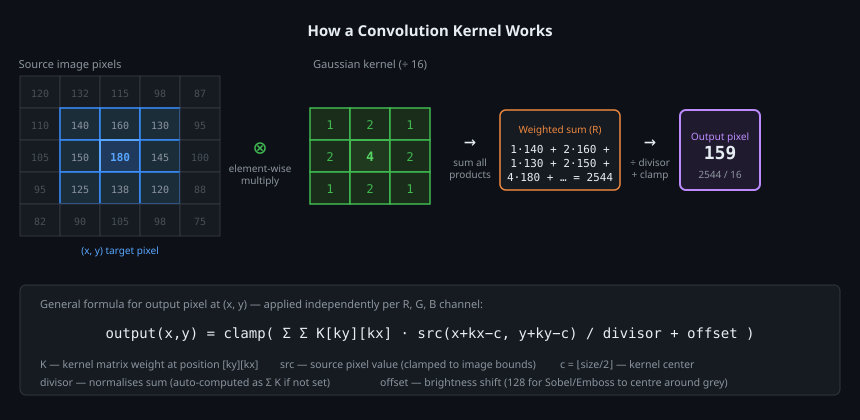
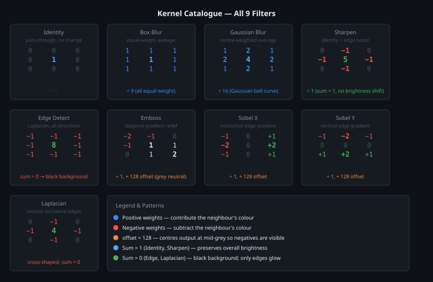
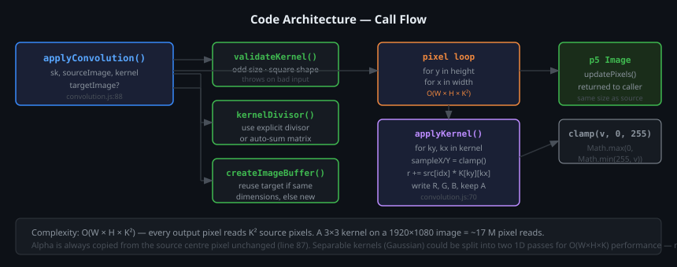

# Image Convolution

A clean, dependency-free implementation of 2D discrete convolution for pixel images, built for use with [p5.js](https://p5js.org/). Ships with nine production-ready kernels and a live interactive demo.

---

## How convolution works

Convolution is the mathematical foundation of nearly every image filter — blur, sharpen, edge detection, emboss. The idea is simple: for every pixel in the output image, look at that pixel **and its neighbours** in the source image, multiply each neighbour's colour by a weight from a small matrix called a **kernel**, sum the results, and write that single value into the output.

Run this for every pixel, independently on R, G, and B, and you get a filtered image.



### The formula

```
output(x, y) = clamp(
    Σ(ky) Σ(kx)  K[ky][kx] · src(x + kx − c,  y + ky − c)  /  divisor
    + offset
)
```

| Symbol | Meaning |
|--------|---------|
| `K[ky][kx]` | Weight at position `(kx, ky)` in the kernel matrix |
| `src(x, y)` | Source pixel value, clamped to image bounds at edges |
| `c` | Kernel centre: `⌊size / 2⌋` (1 for a 3×3 kernel) |
| `divisor` | Normalises the weighted sum so brightness is preserved |
| `offset` | Brightness shift — used by gradient kernels to centre around mid-grey |
| `clamp` | Keeps output in `[0, 255]` — prevents overflow wrapping |

### Why `divisor`?

If all kernel weights are positive and sum to more than 1, the output pixel would be brighter than the source. Dividing by the sum of all weights normalises the result. The code auto-computes this if you don't provide one:

```js
// kernelDivisor() in convolution.js
let sum = 0;
for every weight in matrix: sum += weight;
return sum || 1;  // guard against zero-sum kernels like edge-detect
```

Zero-sum kernels (edge detect, Laplacian) produce a black background because flat areas sum to 0. That's intentional — only colour transitions survive.

### Why `offset = 128`?

Gradient kernels like Sobel and Emboss produce **negative values** where colour decreases in the measured direction. Since pixel values can't be negative, those pixels would clamp to 0 (black) and the gradient direction would be lost. Adding 128 shifts the neutral point to mid-grey, so negative gradients appear as dark grey and positive gradients as light grey.

### Border handling

When the kernel window extends beyond the image boundary (e.g. top-left pixel), `applyKernel` **clamps** the sample coordinates to the nearest valid pixel:

```js
const sampleX = clamp(x + kx - center, 0, width - 1);
const sampleY = clamp(y + ky - center, 0, height - 1);
```

This "nearest-neighbour padding" means every output pixel uses the same full kernel — no special-cased border code, no black borders.

---

## The kernel catalogue



### Blur kernels — reduce high-frequency noise

**Box Blur** — every neighbour has equal weight `1`, divided by 9. Fast and simple, but produces a blocky result because all neighbours contribute equally regardless of distance.

**Gaussian Blur** — weights follow a discrete approximation of the Gaussian (normal) bell curve: the centre contributes most, direct neighbours half as much, and corners least. This matches how optical blur actually works, producing a smoother, more natural result. The 3×3 approximation used here is `[1,2,1; 2,4,2; 1,2,1] / 16`.

### Edge kernels — detect colour transitions

**Edge Detect** — subtracts all eight neighbours from `8×` the centre. Flat areas (all neighbours equal the centre) cancel to 0 → black. Where colour changes (edges), the difference is non-zero → bright line. This is the discrete Laplacian of all eight directions.

**Laplacian** — same principle but only four-directional (N, S, E, W), using the cross-shaped kernel `[0,-1,0; -1,4,-1; 0,-1,0]`. Slightly less sensitive to diagonal edges than the 8-neighbour version.

**Sobel X / Sobel Y** — measure the *directional derivative* of brightness. Sobel X subtracts the left column from the right column (weighted more at the centre row), revealing vertical edges. Sobel Y does the same vertically, revealing horizontal edges. Combining them gives the full gradient magnitude: `√(Gx² + Gy²)`.

### Texture kernels — enhance or stylise

**Sharpen** — identity (`[0,0,0; 0,1,0; 0,0,0]`) plus the negative Laplacian. This is mathematically equivalent to adding the edge signal back onto the original image, which amplifies fine detail. The kernel sum is exactly 1, so average brightness is preserved.

**Emboss** — a diagonal gradient kernel that creates the illusion of depth by mapping the NW→SE brightness ramp to dark→light. The `offset = 128` centres the output at mid-grey so both dark shadows and bright highlights are visible.

---

## Code architecture



### Module structure

```
convolution.js         — core algorithm, exported utilities
convolution-demo.js    — p5.js sketch wiring (UI, keyboard, image loading)
```

### Public API

```js
import { KERNELS, applyConvolution, applyKernel, clamp, createImageBuffer } from './convolution.js';
```

#### `applyConvolution(sk, sourceImage, kernel, targetImage?)`

The main entry point. Validates the kernel, resolves the divisor, allocates (or reuses) an output buffer, then runs the pixel loop.

```js
// Apply a built-in kernel
const blurred = applyConvolution(sk, photo, KERNELS.gaussianBlur);

// Apply a custom kernel inline
const custom = applyConvolution(sk, photo, {
    matrix: [[ 0, -1,  0],
             [-1,  5, -1],
             [ 0, -1,  0]],
    divisor: 1
});

// Reuse an existing output buffer (avoids allocation on every frame)
applyConvolution(sk, photo, KERNELS.sharpen, outputBuffer);
```

#### `applyKernel(sourcePixels, targetPixels, width, height, x, y, matrix, divisor, offset)`

Processes a **single output pixel**. Exported so you can parallelise (Web Workers), tile, or compose multiple passes manually.

#### `KERNELS`

A named object of all nine pre-built kernels. Each has `name`, `matrix`, `divisor`, and optionally `offset`.

---

## Performance

The algorithm is `O(W × H × K²)` — every output pixel reads `K²` source pixels. For a 3×3 kernel on a 1920×1080 image that is ~17 million pixel reads. JavaScript handles this comfortably for still images; real-time video requires a WebGL shader.

**Allocation reuse** — pass an existing `targetImage` to `applyConvolution` and the function checks whether its dimensions match before allocating. This avoids garbage-collection pauses in animation loops:

```js
// In p5.js draw():
filteredImage = applyConvolution(sk, sourceImage, kernel, filteredImage);
//                                                         ↑ reused each frame
```

**Separable kernels** — the Gaussian kernel is mathematically separable: the 2D convolution can be replaced by a horizontal 1D pass followed by a vertical 1D pass, reducing the work from `O(K²)` to `O(2K)` per pixel. This is not currently implemented but is a straightforward optimisation for large kernels.

---

## Running the demo

```bash
# The demo expects p5.js and images/tiger.png to be available.
# Keys 1–9 switch between the nine filters at runtime.

1 — Identity       5 — Edge Detect
2 — Box Blur       6 — Emboss
3 — Gaussian Blur  7 — Sobel X
4 — Sharpen        8 — Sobel Y
                   9 — Laplacian
```

---

## Writing a custom kernel

Any odd-sized square matrix works. The library validates both constraints and throws a descriptive error if they are not met.

```js
// 5×5 stronger Gaussian
const strongBlur = {
    name: "Gaussian Blur 5×5",
    matrix: [
        [1,  4,  6,  4, 1],
        [4, 16, 24, 16, 4],
        [6, 24, 36, 24, 6],
        [4, 16, 24, 16, 4],
        [1,  4,  6,  4, 1]
    ],
    divisor: 256
};

const result = applyConvolution(sk, photo, strongBlur);
```

The `divisor` here is 256 (the sum of all weights), so average brightness is preserved exactly.
