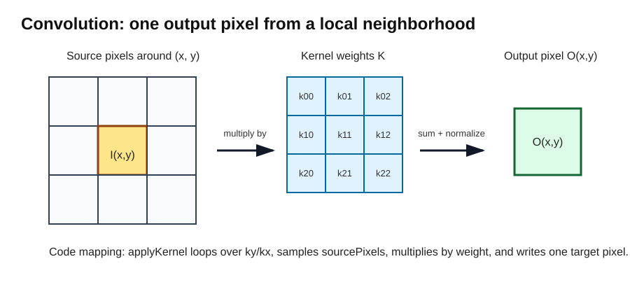
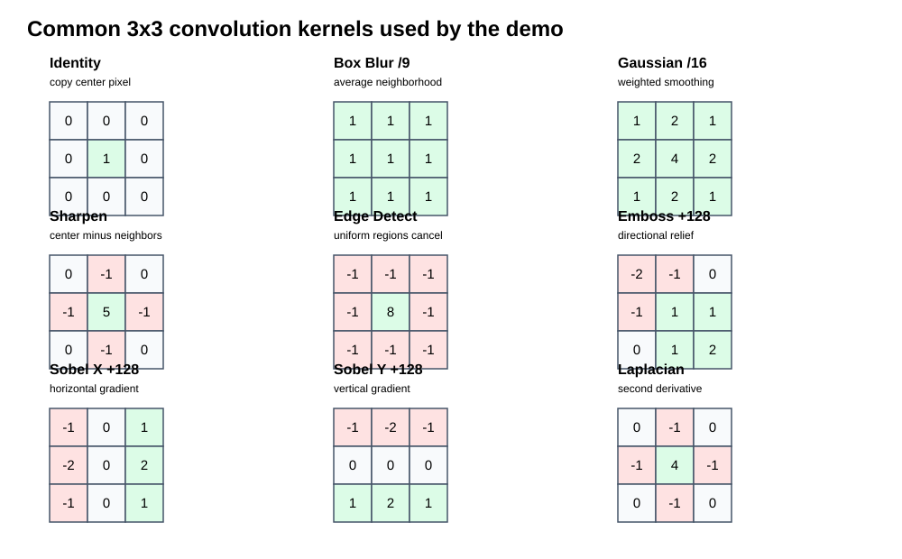
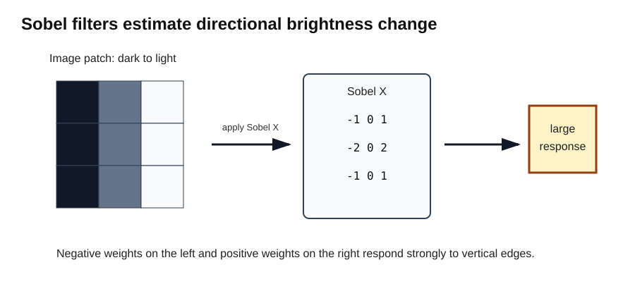
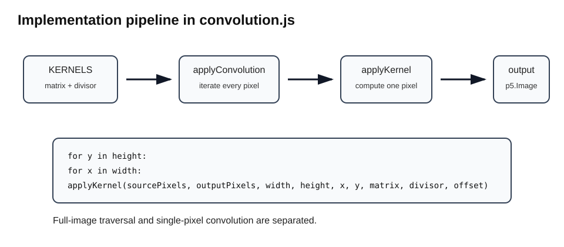
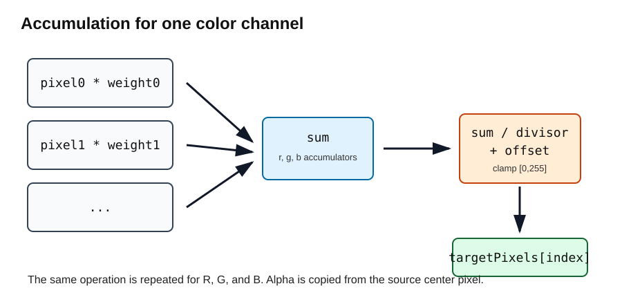
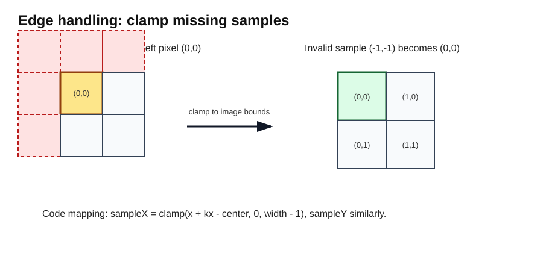

# Image Convolution

This document explains the image convolution demo from three linked perspectives:

1. the mathematics,
2. the algorithm,
3. the actual source-code implementation.

The demo implementation lives in:

- `src/image-processing/convolution.js`
- `src/image-processing/convolution-demo.js`

The central idea is simple: each output pixel is computed by centering a small matrix, called a **kernel**, over a source pixel, multiplying nearby pixels by kernel weights, summing the results, normalizing, and writing the result into a new image.



---

## 1. Mathematical Model

An image can be treated as a discrete two-dimensional function:

```text
I(x, y)
```

For an RGB image, each sample returns three color channels:

```text
I(x, y) = (R, G, B)
```

A convolution produces a new image:

```text
O(x, y)
```

by combining neighboring pixels around `(x, y)`.

For a kernel `K`, divisor `d`, and optional offset `b`:

```text
O(x, y) = (1 / d) * Σ K(i, j) * I(x + i, y + j) + b
```

For the demo, the same operation is applied independently to red, green, and blue. Alpha is copied from the source center pixel.

---

## 2. Kernel Definitions

The demo defines named filters in `KERNELS`. Each kernel has a `name`, a square odd-sized `matrix`, a `divisor`, and sometimes an `offset`.



### Identity

```text
0 0 0
0 1 0
0 0 0
```

The identity kernel copies the center pixel unchanged. This gives an important correctness invariant:

```text
identity convolution must produce a pixel-equivalent copy of the source image
```

### Box Blur

```text
1 1 1
1 1 1
1 1 1

divisor = 9
```

This averages the 3x3 neighborhood.

### Gaussian Blur 3x3

```text
1 2 1
2 4 2
1 2 1

divisor = 16
```

This is a weighted blur. The center contributes the most, cardinal neighbors contribute next, and corners contribute least.

### Sharpen

```text
 0 -1  0
-1  5 -1
 0 -1  0
```

This emphasizes the center pixel while subtracting neighbors.

### Edge Detect

```text
-1 -1 -1
-1  8 -1
-1 -1 -1
```

Uniform regions tend to cancel. Strong changes remain.

### Emboss

```text
-2 -1 0
-1  1 1
 0  1 2

offset = 128
```

The offset recenters negative/positive responses into visible mid-gray image values.

### Sobel X and Sobel Y

Sobel filters estimate directional brightness change.



`Sobel X` responds to changes across the horizontal direction, which makes vertical edges visible. `Sobel Y` responds to changes across the vertical direction, which makes horizontal edges visible.

### Laplacian

```text
 0 -1  0
-1  4 -1
 0 -1  0
```

This estimates a second derivative and highlights regions where intensity changes rapidly.

---

## 3. Algorithm

The implementation separates the algorithm into two levels:

1. `applyConvolution` walks over every destination pixel.
2. `applyKernel` computes one destination pixel.



At a high level:

```text
for each y in image height:
    for each x in image width:
        compute output pixel (x, y) using the kernel
```

For each pixel:

```text
r = 0
g = 0
b = 0

for each kernel row ky:
    for each kernel column kx:
        sample source pixel near (x, y)
        weight = kernel[ky][kx]

        r += source.r * weight
        g += source.g * weight
        b += source.b * weight

target.r = clamp(r / divisor + offset)
target.g = clamp(g / divisor + offset)
target.b = clamp(b / divisor + offset)
target.a = source center alpha
```



---

## 4. Source Code Mapping

### Kernel storage

`KERNELS` is the table of named filters.

Conceptually:

```text
K = matrix
d = divisor
b = offset
```

The code stores these as object literals. This keeps the mathematical object visible and editable.

### Clamp helper

```js
export const clamp = (value, min = 0, max = 255) =>
    Math.max(min, Math.min(max, value));
```

The same helper is used for two concepts:

1. clamping pixel coordinates at image borders,
2. clamping output color values to `[0, 255]`.

### Pixel indexing

A p5 image stores pixels in a flat array:

```text
[R, G, B, A, R, G, B, A, ...]
```

The implementation maps `(x, y)` to the red-channel index:

```js
const pixelIndex = (x, y, width) => (y * width + x) * 4;
```

This bridges the mathematical image model:

```text
I(x, y)
```

and the memory representation:

```text
pixels[(y * width + x) * 4]
```

### Kernel validation

The implementation validates that a kernel is non-empty, odd-sized, and square.

This matters because the algorithm assumes a center cell exists:

```js
const center = Math.floor(matrix.length / 2);
```

Even-sized kernels do not have a single natural center.

### Divisor calculation

If a kernel supplies a divisor, the implementation uses it. Otherwise it computes the sum of all kernel weights. If the sum is zero, it falls back to `1`.

This protects edge-detection kernels, whose weights often sum to zero.

### `applyKernel`

`applyKernel` computes exactly one output pixel.

The core loop samples the source image around `(x, y)`:

```js
for (let ky = 0; ky < matrix.length; ky += 1) {
    const sampleY = clamp(y + ky - center, 0, height - 1);
    const row = matrix[ky];

    for (let kx = 0; kx < row.length; kx += 1) {
        const sampleX = clamp(x + kx - center, 0, width - 1);
        const sourceIndex = pixelIndex(sampleX, sampleY, width);
        const weight = row[kx];

        r += sourcePixels[sourceIndex] * weight;
        g += sourcePixels[sourceIndex + 1] * weight;
        b += sourcePixels[sourceIndex + 2] * weight;
    }
}
```

This is the direct implementation of:

```text
Σ K(i, j) * I(x + i, y + j)
```

### Output write

After accumulation, the implementation writes the normalized and clamped output:

```js
targetPixels[targetIndex] = clamp((r / divisor) + offset);
targetPixels[targetIndex + 1] = clamp((g / divisor) + offset);
targetPixels[targetIndex + 2] = clamp((b / divisor) + offset);
targetPixels[targetIndex + 3] = sourcePixels[centerIndex + 3];
```

The first three channels are convolved. Alpha is copied from the original center pixel.

---

## 5. Edge Handling

At borders, the kernel asks for pixels that do not exist. For example, at `(0, 0)`, a 3x3 kernel wants to sample negative coordinates.

The implementation clamps each sample coordinate:

```js
const sampleY = clamp(y + ky - center, 0, height - 1);
const sampleX = clamp(x + kx - center, 0, width - 1);
```

So an invalid coordinate such as `-1` becomes `0`.



This means every destination pixel can use the same kernel shape. The tradeoff is that border pixels reuse edge samples.

---

## 6. Demo Implementation

The p5 demo is intentionally device-space only.

It does not use scenegraph, `graphics_context2`, world transforms, custom UI frameworks, or shaders.

That is the right choice for this first image-processing demo.

The demo loads:

```js
const IMAGE_SOURCE = "images/tiger.png";
```

It stores state in closure variables:

```js
let sourceImage = null;
let filteredImage = null;
let selectedIndex = 0;
let loading = true;
let loadError = "";
```

This matches the project preference for factory functions and local closure state.

### Recompute policy

The demo only recomputes when the source image loads or the user selects a different filter:

```js
const recompute = () => {
    if (!sourceImage) return;
    filteredImage = applyConvolution(sk, sourceImage, selectedKernel(), filteredImage);
};
```

This avoids expensive per-pixel convolution every frame.

### Filter selection

Keyboard input maps number keys to filters:

```text
1 identity
2 box blur
3 gaussian blur
4 sharpen
5 edge detect
6 emboss
7 sobel X
8 sobel Y
9 laplacian
```

### Layout

The demo displays the original image on the left, the filtered image on the right, the active filter name, the kernel matrix, and keyboard instructions.

---

## 7. Complexity

Let:

```text
W = image width
H = image height
K = kernel width/height
```

The algorithm visits every pixel and applies a `K x K` kernel.

```text
time = O(W * H * K^2)
```

For a 3x3 kernel, this is 9 weighted samples per output pixel per color channel.

The output image requires:

```text
space = O(W * H)
```

The demo reuses `filteredImage` when possible, avoiding repeated output allocation.

---

## 8. Engineering Notes

### Why this implementation is educational

The implementation is intentionally explicit. It does not use browser canvas filters, WebGL shaders, or library image-processing functions.

That makes the core algorithm visible:

```text
nested loops
pixel indexing
kernel weights
accumulators
normalization
clamping
```

### Why identity is important

Identity is a test oracle. If identity does not reproduce the original image, then one of these is probably wrong:

- pixel indexing,
- kernel center offset,
- coordinate clamping,
- output write indexing,
- image scaling/display logic.

### Why alpha is copied

The demo focuses on RGB convolution. Convolving alpha could create unexpected transparency artifacts. Copying source alpha preserves opacity behavior.

### Why p5 pixel density is set to 1

The demo calls:

```js
sk.pixelDensity?.(1);
```

This keeps the image/pixel relationship simpler across high-DPI displays.

---

## 9. Possible Extensions

### Separable Gaussian blur

The 3x3 Gaussian kernel:

```text
1 2 1
2 4 2
1 2 1
```

can be expressed as an outer product:

```text
[1 2 1]^T [1 2 1]
```

This allows one 2D convolution to be replaced by two 1D passes.

### Gradient magnitude

Sobel X and Sobel Y can be combined:

```text
magnitude = sqrt(gx^2 + gy^2)
```

That produces orientation-independent edge strength.

### Grayscale preprocessing

Many edge detectors are easier to reason about on grayscale intensity rather than full RGB.

### Larger kernels

The current code supports arbitrary odd-sized square kernels. Adding 5x5 or 7x7 filters would exercise the same algorithm with greater computational cost.

### GPU implementation

The same conceptual model maps naturally to fragment shaders:

```text
one fragment shader invocation = one output pixel
neighbor texture samples = kernel neighborhood
```

---

## 10. Summary

This demo demonstrates:

- mathematical convolution,
- kernel-based filtering,
- raster memory indexing,
- edge handling,
- output normalization,
- p5 image pixel buffers,
- interactive algorithm visualization.

Most importantly, the code and explanation are aligned:

```text
math formula
    maps to
nested loops
    maps to
pixel buffer operations
    maps to
visible image transformation
```
